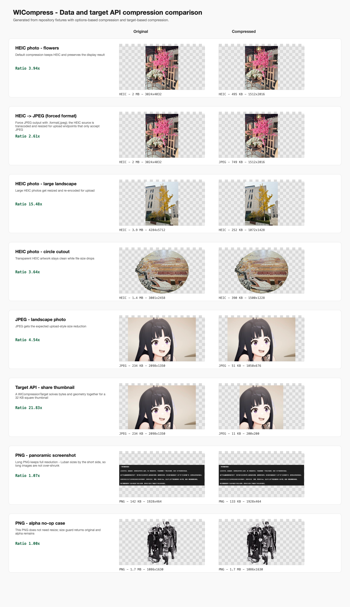

# WICompress


English | [简体中文](README_CN.md)

`WICompress` is a lightweight ImageIO-based image compression library for
JPEG, PNG, and HEIC/HEIF data. It uses the Luban resize strategy, preserves the
source container format by default, and exposes a UIKit/AppKit-free core API.

## Highlights

- Data-first API: pass original `Data` or a file `URL`, receive compressed `Data`.
- UIKit/AppKit-free core: suitable for iOS apps and macOS-side SwiftPM tests.
- Format preservation: JPEG stays JPEG, PNG stays PNG, HEIC/HEIF stays HEIC/HEIF.
- Luban resize policy: downsample large images while preserving display dimensions.
- Metadata policy: strip Exif/GPS-style metadata by default, or preserve it explicitly.
- Strong error model: failures are reported with `WICompressError`, not `nil`.

## Requirements

- iOS 14.0+
- macOS 11.0+
- Swift 6.0+

## Installation

### Swift Package Manager

1. Open your project in Xcode.
2. Select **File** -> **Add Packages**.
3. Enter the repository URL: `https://github.com/Weixi779/WICompress`.
4. Select a version and add the `WICompress` product.

## Quick Start

```swift
import WICompress

let compressedData = try WICompress.compress(originalData)
```

Compress a file URL:

```swift
let compressedData = try WICompress.compress(contentsOf: imageURL)
```

Use explicit options:

```swift
let compressedData = try WICompress.compress(
    originalData,
    options: WICompressOptions(
        resize: .luban,
        format: .preserve,
        metadata: .strip,
        quality: .compression(0.7)
    )
)
```

## Compression Preview

The comparison image below is generated from repository fixtures with
`scripts/generate-doc-assets.swift`, so it can be regenerated when compression
behavior changes.

```bash
swift run WICompressDocAssetGenerator
```



The preview uses the default API for every row. It shows three HEIC photos first
because HEIC is the most important real-world case, then JPEG and PNG examples.
PNG is not skipped: the panoramic screenshot shrinks when Luban resize is
triggered, while the alpha PNG is a no-op case where the original data is
already the better result.

## Working With UIKit or AppKit

`WICompress` does not take `UIImage` or `NSImage`. Keep the original image data
from your picker, file, network response, or database, pass that data to
`WICompress`, and decode the result at the UI boundary if you need a preview.

```swift
guard let originalData = try await photosPickerItem.loadTransferable(type: Data.self) else {
    throw MyError.missingImageData
}

let compressedData = try WICompress.compress(originalData)
let previewImage = UIImage(data: compressedData)
```

This shape avoids asking callers to pass both a rendered image and separate
format data. ImageIO can inspect dimensions, orientation, format, and metadata
directly from the original bytes.

## Options

`WICompressOptions.default` is tuned for upload-style compression:

```swift
WICompressOptions(
    resize: .luban,
    format: .preserve,
    metadata: .strip,
    quality: .compression(0.6)
)
```

### Resize

```swift
public enum WIResizePolicy {
    case none
    case luban
}
```

- `.luban`: default. Downsamples large images using the Luban ratio.
- `.none`: keeps the source display dimensions.

### Format

```swift
public enum WIFormatPolicy {
    case preserve
}
```

The initial public release only supports `.preserve`. Explicit conversion such
as PNG -> JPEG is not included because alpha flattening requires an explicit
background policy.

### Metadata

```swift
public enum WIMetadataPolicy {
    case strip
    case preserve
}
```

- `.strip`: default. Removes strippable metadata such as Exif/GPS/TIFF/maker
  dictionaries when rewriting is required.
- `.preserve`: keeps normal metadata and orientation tags by using the
  source-copy write path when possible.

Color profiles are display semantics, not privacy metadata. Display P3 profiles
are expected to survive both source-copy and redraw paths.

HDR gain maps are not preserved by the initial public release. They require a
separate policy and test contract because gain maps are auxiliary image data,
not ordinary Exif/GPS metadata.

### Quality

```swift
public enum WIQualityPolicy {
    case none
    case compression(Double)
}
```

- `.compression(value)`: clamps `value` into `0.0...1.0` and applies it to
  lossy destination formats such as JPEG and HEIC.
- `.none`: does not set `kCGImageDestinationLossyCompressionQuality`.

`.none` does not mean lossless and does not promise byte-for-byte output unless
the write plan can safely return the original data.

PNG is lossless; the quality policy is intentionally a no-op for PNG.

## Error Handling

All public APIs throw `WICompressError`.

```swift
do {
    let compressedData = try WICompress.compress(data)
} catch let error as WICompressError {
    // Decide whether to show an error, retry, or keep the original data.
    print(error)
}
```

Common cases:

- `invalidImageData`
- `imageInfoUnavailable`
- `unsupportedSourceFormat`
- `unsupportedDestinationFormat`
- `animatedSourceUnsupported`
- `thumbnailCreationFailed`
- `destinationCreationFailed`
- `encodeFailed`

## Current Limits

The initial public release intentionally does not include:

- `UIImage` / `NSImage` convenience adapters
- Live Photo compression
- async API
- explicit `.jpeg` / `.png` / `.heic` conversion policies
- PNG -> JPEG alpha-background flattening
- target-byte-size compression
- HDR gain map preservation
- animated image output
- WebP / JPEG XL writing

For Live Photos, compressing the still image resource alone is not enough: the
paired video resource and pairing metadata also need to be handled. That belongs
in a Photos-level workflow, not the v1 ImageIO core.

## Upgrading From 0.x

WICompress 1.0.0 replaces the old `UIImage`-oriented API with the `Data`/`URL`
core API shown above. See [CHANGELOG.md](CHANGELOG.md) for the breaking change
summary.

## Example Project

The repository includes a SwiftUI example app:

1. Open `Example/WICompressExample/WICompressExample.xcodeproj`.
2. Build and run on an iOS device or simulator.
3. Pick an image and compare the original data with the compressed data.

The example demonstrates:

- `PhotosPicker` and `PHPickerViewController` data loading
- raw `Data` compression
- format detection
- original/compressed preview
- file-size and compression-ratio display

## Testing

The core is covered by Swift Testing on macOS and by iOS simulator tests:

```bash
swift test
xcrun simctl list devices available
xcodebuild test \
  -workspace .swiftpm/xcode/package.xcworkspace \
  -scheme WICompress-Package \
  -destination 'id=<UDID>' \
  CODE_SIGNING_ALLOWED=NO
```

## License

WICompress is available under the Apache-2.0 license. See `LICENSE.txt` for details.
