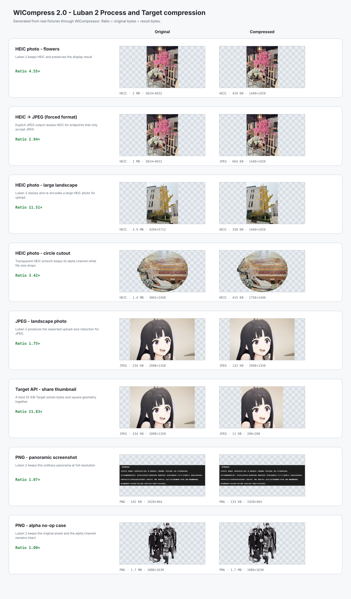

# WICompress

[](https://github.com/Weixi779/WICompress/actions/workflows/ci.yml)


English | [简体中文](README_CN.md)

Image processing and compression for Swift, built on ImageIO and Core Graphics.
Encoded `Data` or a file `URL` goes in; one typed `WIResult` comes out. The core
does not depend on UIKit or AppKit.

The package publishes two independent libraries:

| Product | Purpose |
| --- | --- |
| `WICompress` | High-level Process and hard byte-target compression, with sync and async terminals. |
| `WIImageIO` | Lower-level synchronous inspection, decode, thumbnail, transcode, and encode primitives. |

## Compression Preview

These theme-aware diagrams are generated from real repository fixtures through
the public API. They explicitly use Luban 2 and include format conversion,
Target compression, HEIC, JPEG, PNG, transparency, and passthrough cases.

<picture>
  <source media="(prefers-color-scheme: dark)" srcset="docs/assets/compression-comparison-dark.svg">
  <source media="(prefers-color-scheme: light)" srcset="docs/assets/compression-comparison-light.svg">
  
</picture>

Regenerate both variants with `swift run WICompressDocAssetGenerator`.

## Quick Start

WICompress 2.0 requires Swift 6.2 / Xcode 26 or later. It supports iOS 14,
macOS 11, Mac Catalyst 14, tvOS 14, watchOS 7, and visionOS 1 or later.

```swift
dependencies: [
    .package(url: "https://github.com/Weixi779/WICompress.git", from: "2.0.1")
]
```

Add the high-level product to an application target. Choose `WIImageIO`
instead when only the lower-level primitives are needed:

```swift
.target(
    name: "YourApp",
    dependencies: [
        .product(name: "WICompress", package: "WICompress")
    ]
)
```

Use **Process** when the application chooses the operation. The final byte count
is an outcome, not a promise:

```swift
import WICompress

let result = try await WICompressor.process(imageData)
```

Use **Target** when every successful result must satisfy a hard byte ceiling:

```swift
let result = try await WICompressor.compress(
    imageData,
    to: WICompressionTarget(maxBytes: 500_000)
)
```

| | Process | Target |
| --- | --- | --- |
| Terminal | `WICompressor.process` | `WICompressor.compress` |
| Caller states | Crop, resizing, quality, and output. | `maxBytes`, optional base geometry, and output. |
| Library controls | Execution path. | Candidate quality and dimensions. |
| Byte guarantee | None. | `result.byteCount <= maxBytes`. |
| Default output | Preserve source representation. | PNG for alpha; JPEG otherwise. |

Both paths return encoded `data`, `format`, integer `pixelSize`, and `byteCount`
in `WIResult`. Every Data/file terminal also has a synchronous overload.

### A common upload configuration

```swift
let upload = try await WICompressor.process(
    imageData,
    using: WIImageProcess(
        sizing: .resize(using: WIImageResize.maximumPixelSize(1_600)),
        quality: 0.7,
        output: WIImageOutput(
            representation: .jpeg(background: .white),
            metadata: .strip,
            colorSpace: .convert(to: .sRGB)
        )
    )
)
```

JPEG conversion never silently discards transparency. Choose `.white`,
`.black`, or a caller-supplied opaque `.color(...)` background.

## Use WIImageIO Directly

Choose the separate `WIImageIO` product when typed ImageIO operations are the
actual requirement:

```swift
import UniformTypeIdentifiers
import WIImageIO

let reader = try ImageReader(imageData)
let descriptor = reader.descriptor

let encoded = try reader
    .thumbnail(options: .init(maximumPixelSize: 1_200))
    .encode(
        as: .jpeg,
        options: .init(compressionQuality: 0.75)
    )
```

The API hides `CGImageSource`, `CGImageDestination`, property dictionaries, and
global coder registries. WIImageIO stays synchronous; its caller owns
scheduling.

## Example and Benchmark

The [SwiftUI example](Example/WICompressExample) demonstrates `PhotosPicker`,
source inspection, asynchronous Process/Target calls, cooperative cancellation,
and before/after facts:

```bash
open Example/WICompressExample/WICompressExample.xcodeproj
```

The repository also contains a Release-mode developer benchmark for Target
compression. It is not a public package product:

```bash
swift run -c release TargetCompressionBenchmark
```

See the [benchmark guide](benchmarks/target-compression/README.md) for fixed
corpora, quality metrics, and baseline/candidate comparison.

## Documentation

- [WICompress DocC](Sources/WICompress/Documentation.docc/WICompress.md)
- [WIImageIO DocC](Sources/image/io/WIImageIO.docc/WIImageIO.md)
- [Architecture](docs/architecture/README.md)
- [Migrating to 2.0](docs/guides/MIGRATION_2.md)
- [Changelog](CHANGELOG.md)

Async cancellation is cooperative and remains the standard
`CancellationError`; processing failures use `WICompressError`. See the DocC
guides for complete behavior and API examples.

## License

WICompress is available under the Apache-2.0 license. See
[LICENSE.txt](LICENSE.txt).
