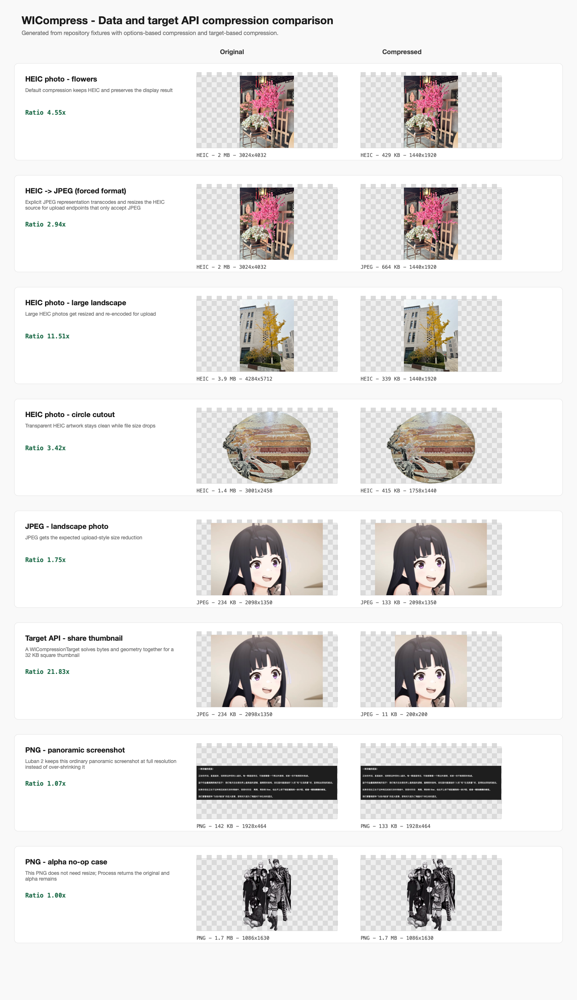

# WICompress

[](https://github.com/Weixi779/WICompress/actions/workflows/ci.yml)


English | [简体中文](README_CN.md)

Compress images for upload with a small, predictable Swift API.

`WICompress` is an ImageIO-backed Swift image compression library that operates
directly on original image `Data` or file `URL` input. ImageIO handles format
inspection, orientation, alpha, metadata, color profiles, resizing, and encoding;
the public API stays simple and returns compressed `Data`.

It preserves JPEG/PNG/HEIC by default, can convert to an explicit output format
or choose PNG/JPEG from alpha-channel presence, strips metadata for privacy, and
resizes images without depending on `UIImage` or `NSImage`.

```swift
let compressedData = try WICompress.compress(originalData)
```

```swift
let uploadData = try WICompress.compress(
    originalData,
    options: WICompressOptions(
        resize: .maxPixel(1600),
        format: .jpeg(background: .white),
        metadata: .strip,
        quality: .compression(0.7)
    )
)
```

## Why WICompress

- **Data in, Data out**: keep picker/file/network bytes and pass them directly
  to the compressor.
- **Upload-ready defaults**: Luban resize, metadata stripping, and JPEG/HEIC
  lossy quality are configured for common app uploads.
- **Target contracts**: use `maxBytes` with geometry intent when an SDK or
  backend requires a hard byte ceiling.
- **Flexible resize policies**: use Luban, cap the longest side, or fit an image
  into caller-supplied minimum/maximum display dimensions.
- **Format control**: preserve the source container or explicitly output JPEG,
  PNG, HEIC, or choose PNG for alpha-channel sources and JPEG otherwise.
- **Alpha-safe JPEG conversion**: transparent sources require an explicit white
  or black background instead of silently flattening.
- **Orientation-safe resizing**: display dimensions are resolved from ImageIO
  metadata, then redraw paths bake orientation into pixels.
- **UIKit/AppKit-free core**: the compression pipeline works in iOS apps,
  macOS tools, and SwiftPM tests without UI image types.
- **Typed failures**: errors are surfaced as `WICompressError`, not optional
  `nil` results.

## Requirements and Installation

- iOS 14+ / macOS 11+ / Mac Catalyst 14+ / tvOS 14+ / watchOS 7+ / visionOS 1+
- Swift 6.0+ (Xcode 16+)

Add WICompress to your project with Swift Package Manager:

```swift
dependencies: [
    .package(url: "https://github.com/Weixi779/WICompress.git", from: "1.4.0")
]
```

## Compression Preview

The comparison image below is generated from repository fixtures with
`scripts/generate-doc-assets.swift`, so it can be regenerated when compression
behavior changes.

```bash
swift run WICompressDocAssetGenerator
```



The preview uses the default API for most rows and includes one target-based
sharing thumbnail row built from an explicit `WICompressionTarget`. It shows
three HEIC photos first because HEIC is the most important real-world case, then
JPEG and PNG examples. PNG is not skipped: the panoramic screenshot shrinks when
Luban resize is triggered, while the alpha PNG is a no-op case where the
original data is already the better result.

## Example Project

The repository includes a SwiftUI example app:

1. Open `Example/WICompressExample/WICompressExample.xcodeproj`.
2. Build and run on an iOS device or simulator.
3. Pick an image and compare the original data with the compressed data.

The example demonstrates:

- `PhotosPicker` and `PHPickerViewController` data loading
- raw `Data` compression
- format detection
- original/compressed preview
- file-size and compression-ratio display

## API Examples

```swift
import WICompress

let compressedData = try WICompress.compress(originalData)
```

Compress a file URL:

```swift
let compressedData = try WICompress.compress(contentsOf: imageURL)
```

Use explicit options:

```swift
let compressedData = try WICompress.compress(
    originalData,
    options: WICompressOptions(
        resize: .luban,
        format: .preserve,
        metadata: .strip,
        quality: .compression(0.7)
    )
)
```

Fit image assets into a caller-defined display-size range:

```swift
let assetData = try WICompress.compress(
    originalData,
    options: WICompressOptions(
        resize: .fit(
            minSize: WISize(width: 40, height: 50),
            maxSize: WISize(width: 400, height: 467)
        ),
        format: .pngIfAlphaOtherwiseJPEG,
        metadata: .strip,
        quality: .compression(0.7)
    )
)
```

Compress to a hard byte target:

```swift
let thumbnail = try WICompress.compress(
    originalData,
    to: WICompressionTarget(
        maxBytes: 32 * 1024,
        sizing: WICompressionSizing(
            maximumPixelSize: 200,
            aspectRatio: WIAspectRatio(width: 1, height: 1)
        ),
        output: WIImageOutput(
            representation: .jpeg(background: .white),
            metadata: .strip,
            colorSpace: .convert(to: .sRGB)
        )
    )
)

print(thumbnail.byteCount)
print(thumbnail.pixelSize)
```

## Working With UIKit or AppKit

`WICompress` does not take `UIImage` or `NSImage`. Keep the original image data
from your picker, file, network response, or database, pass that data to
`WICompress`, and decode the result at the UI boundary if you need a preview.

```swift
guard let originalData = try await photosPickerItem.loadTransferable(type: Data.self) else {
    throw MyError.missingImageData
}

let compressedData = try WICompress.compress(originalData)
let previewImage = UIImage(data: compressedData)
```

This shape avoids asking callers to pass both a rendered image and separate
format data. ImageIO can inspect dimensions, orientation, format, and metadata
directly from the original bytes.

## Options

`WICompressOptions.default` is tuned for upload-style compression:

```swift
WICompressOptions(
    resize: .luban,
    format: .preserve,
    metadata: .strip,
    quality: .compression(0.6),
    colorSpace: .preserve
)
```

### Resize

```swift
public struct WISize {
    public var width: Double
    public var height: Double
}

public enum WIResizePolicy {
    case none
    case luban
    case maxPixel(Int)
    case fit(minSize: WISize, maxSize: WISize)
}
```

- `.luban`: default. Downsamples large images using the Luban ratio.
- `.maxPixel(value)`: caps the longest display side to `value` pixels and never
  upscales smaller images.
- `.fit(minSize:maxSize:)`: keeps aspect ratio, upscales only when both display
  sides are below `minSize`, downscales when either side exceeds `maxSize`, and
  leaves the image unchanged when it is already within `maxSize` and not below
  `minSize`. This policy can enlarge small bitmap assets; the core remains
  UIKit/AppKit-free.
- `.none`: keeps the source display dimensions.

### Format

```swift
public enum WIJPEGBackground {
    case disallow
    case white
    case black
    case color(WIColor)
}

public enum WIFormatPolicy {
    case preserve
    case jpeg(background: WIJPEGBackground = .disallow)
    case pngIfAlphaOtherwiseJPEG
    case png
    case heic
}
```

- `.preserve`: default. Keeps the source image container.
- `.jpeg(background:)`: writes JPEG. Transparent sources require `.white`,
  `.black`, or `.color(WIColor)`; `.disallow` throws instead of silently
  flattening alpha.
- `.pngIfAlphaOtherwiseJPEG`: writes PNG when the source has an alpha channel,
  otherwise writes JPEG.
- `.png`: writes PNG. The quality policy is ignored because PNG is lossless.
- `.heic`: writes HEIC when the current platform can encode it.

Explicit format conversion and alpha-aware format selection always rewrite the
image. The size guard will not return original bytes when the caller requested a
non-preserving destination policy.

### Metadata

```swift
public enum WIMetadataPolicy {
    case strip
    case preserve
}
```

- `.strip`: default. Removes strippable metadata such as Exif/GPS/TIFF/maker
  dictionaries when rewriting is required.
- `.preserve`: keeps normal metadata and orientation tags by using the
  source-copy write path when possible.

When format conversion forces the redraw path, `.preserve` re-attaches ordinary
metadata dictionaries where ImageIO supports them. Orientation is still baked
into pixels and reset to `1`, because preserving the original rotation tag after
redraw would double-rotate readers.

Color profiles are display semantics, not privacy metadata. Display P3 profiles
are expected to survive both source-copy and redraw paths.

HDR gain maps are not preserved by the initial public release. They require a
separate policy and test contract because gain maps are auxiliary image data,
not ordinary Exif/GPS metadata.

### Color Space

```swift
public enum WIColorSpace {
    case sRGB
    case displayP3
    case iccProfile(Data)
}

public enum WIOutputColorSpace {
    case preserve
    case convert(to: WIColorSpace)
    case preserveIfSupported(Set<WIColorSpace>, otherwise: WIColorSpace)
}

public struct WIColor {
    public var red: Double
    public var green: Double
    public var blue: Double
    public var alpha: Double
    public var colorSpace: WIColorSpace
}
```

- `.preserve`: default. Keeps normal source display semantics. RGB profiles
  such as Display P3 survive copy and redraw paths when ImageIO can represent
  them.
- `.convert(to:)`: redraws into the requested color space. Explicit conversion
  is never bypassed by the size guard.
- `.preserveIfSupported(_:otherwise:)`: keeps known supported spaces, such as
  sRGB and Display P3, and converts unsupported or unknown sources to the
  fallback.

Color-space inspection is lazy. The default `.preserve` policy does not decode
pixels only to identify the source profile.

### Quality

```swift
public enum WIQualityPolicy {
    case none
    case compression(Double)
}
```

- `.compression(value)`: clamps `value` into `0.0...1.0` and applies it to
  lossy destination formats such as JPEG and HEIC.
- `.none`: does not set `kCGImageDestinationLossyCompressionQuality`.

`.none` does not mean lossless and does not promise byte-for-byte output unless
the write plan can safely return the original data.

PNG is lossless; the quality policy is intentionally a no-op for PNG.

## Target Compression

`WICompressionTarget` is for APIs that need output bytes to satisfy a contract,
for example "thumbnail data must be under 32 KB." It is separate from
`WICompressOptions` because the compressor controls quality, dimensions, and
attempt count internally.

```swift
public struct WICompressionTarget {
    public let maxBytes: Int
    public let sizing: WICompressionSizing
    public let output: WIImageOutput
}

public struct WICompressionSizing {
    public let maximumPixelSize: Int?
    public let aspectRatio: WIAspectRatio?
    public let anchor: WICropAnchor
}
```

The Target default output writes PNG for Alpha sources and JPEG otherwise,
strips metadata, and converts pixels to sRGB. Passing an explicit
`WIImageOutput` replaces that product default with the stated requirements.

Sizing defines the base candidate before byte search begins:

- With neither value, search starts from the oriented source pixel size.
- `maximumPixelSize` proportionally caps the longest side and never upscales.
- `aspectRatio` takes the largest crop at that ratio, positioned by `anchor`.
- With both values, WICompress crops first and then applies the pixel bound.

`anchor` uses normalized `0...1` top-left-origin coordinates and defaults to the
center. The ratio and crop are resolved once; the solver only searches a uniform
scale and lossy quality. JPEG and HEIC search quality before reducing dimensions.
PNG stays lossless and reduces dimensions. If no result can satisfy both the
output contract and byte ceiling, WICompress throws
`WICompressError.targetUnsatisfiable`.

Target compression returns `WICompressionResult`, including the encoded `Data`,
container format, integer pixel size, and byte count.

WICompress does not ship platform-specific sharing presets. Sharing SDK rules
and recommendations change over time, so application code should define its own
targets from the current SDK documentation and product requirements.

## Error Handling

All public APIs throw `WICompressError`.

```swift
do {
    let compressedData = try WICompress.compress(data)
} catch let error as WICompressError {
    // Decide whether to show an error, retry, or keep the original data.
    print(error)
}
```

Common cases:

- `invalidImageData`
- `imageInfoUnavailable`
- `unsupportedSourceFormat`
- `unsupportedDestinationFormat`
- `transparentSourceRequiresBackground`
- `unsupportedColorSpace`
- `invalidICCProfile`
- `colorConversionFailed`
- `nonOpaqueJPEGBackground`
- `animatedSourceUnsupported`
- `invalidTarget`
- `targetUnsatisfiable`
- `resourceLimitExceeded`
- `thumbnailCreationFailed`
- `imageDecodeFailed`
- `destinationCreationFailed`
- `encodeFailed`

## Current Limits

WICompress intentionally does not include:

- `UIImage` / `NSImage` convenience adapters
- Live Photo compression
- async API
- GPS-only metadata stripping
- HDR gain map preservation
- animated image output
- WebP / JPEG XL writing

For Live Photos, compressing the still image resource alone is not enough: the
paired video resource and pairing metadata also need to be handled. That belongs
in a Photos-level workflow, not the v1 ImageIO core.

## Upgrading From 0.x

WICompress 1.0.0 replaces the old `UIImage`-oriented API with the `Data`/`URL`
core API shown above. See [CHANGELOG.md](CHANGELOG.md) for the breaking change
summary.

## License

WICompress is available under the Apache-2.0 license. See `LICENSE.txt` for details.
