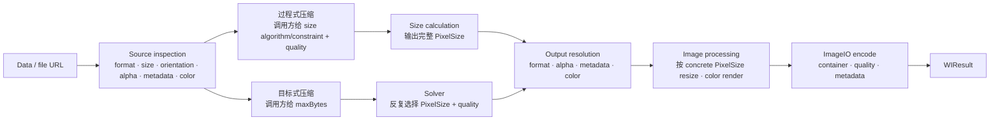

# WICompress 2.0 能力地图与组合盘点

状态：证据库；不作为 2.0 实施合同。

本文先记录 WICompress 当前已经提供的用户需求、公共能力、组合方式和限制，再作为
2.0 Domain 分类的共同输入。它可以保留较长的调研过程、1.x 对照和历史 Claim，但不再
拥有已经冻结的 2.0 结论。

2.0 的单一决策来源按所有权拆分：

- [`V2_DOMAIN_MODEL_CN.md`](V2_DOMAIN_MODEL_CN.md)：跨产品线的共享冻结边界。
- [`V2_IMAGE_PROCESS_CN.md`](V2_IMAGE_PROCESS_CN.md)：`WIImageProcess` 的冻结合同。
- [`V2_COMPRESSION_TARGET_CN.md`](V2_COMPRESSION_TARGET_CN.md)：
  `WICompressionTarget` 的冻结合同。
- [`V2_IMAGE_IO_CN.md`](V2_IMAGE_IO_CN.md)：ImageIO package target 与同步 primitive。
- [`V2_IMAGE_RASTER_CN.md`](V2_IMAGE_RASTER_CN.md)：Core Graphics raster target 与
  单次绘制合同。

## 这份文档回答什么

1. 1.x 当前能够解决哪些外部需求。
2. 每项需求由哪些更小的能力组成。
3. 哪些能力可以组合，哪些天然互斥，哪些只有满足条件时才能组合。
4. 同一需求是否在过程式压缩和目标式压缩中被重复建模。
5. 各项 2.0 判断最初由什么事实和对照材料支持。

本文刻意不回答：

- 2.0 最终类型名和函数签名。
- 已冻结边界的最终正文。
- `WIImageProcess` 最终行为合同。
- target solver 的具体启发式算法和参数。

## 盘点标记

这些标记描述材料被收集时的状态；迁移后的最终决定以各 Domain 文档为准。

| 标记 | 含义 |
|---|---|
| Current | 1.x 已经存在且有实现或测试支撑的行为 |
| Accept | 已经接受的 2.0 产品或架构边界 |
| Candidate | 值得继续讨论的组装形式，不是已接受 API |
| Defer | 有价值，但不进入当前 2.0 Domain 决策 |
| Needs Evidence | 当前代码存在，但是否继续成为 2.0 公共承诺尚未确认 |
| Reject | 已明确不采用的边界或方向 |

## 当前面向用户的需求清单

| 编号 | 用户需求 | 当前入口或类型 | 当前结果与保证 |
|---|---|---|---|
| R1 | 从内存中的图片数据压缩 | `compress(_:options:)` | 返回编码后的 `Data`，失败抛 `WICompressError` |
| R2 | 从文件读取并压缩 | `compress(contentsOf:options:)` | 读取失败映射为 `fileReadFailed` |
| R3 | 声明压缩过程 | `WICompressOptions` | 调用方指定 resize、格式、metadata、quality、颜色空间 |
| R4 | 声明最终字节上限 | `compress(_:to:)` | 成功结果保证 `byteCount <= maxBytes`，否则失败 |
| R5 | 获取压缩的结构化结果 | `WIResult` | Process 与 Target 均返回 `Data`、格式、像素尺寸和字节数 |
| R6 | 保持原始显示尺寸 | `.none` / `.original` | 不主动缩放；target solver 在软几何下仍可因字节限制缩小 |
| R7 | 使用 Luban 规则缩放 | `.resize(.luban)` | 根据 EXIF 方向后的显示尺寸推导最长边，不放大 |
| R8 | 限制最长边 | `.maxPixel(Int)` / `.fit(maxLongSide:)` | 保持宽高比，不放大 |
| R9 | 适配尺寸边界 | `.fit(minSize:maxSize:)` / `.fitInside(box:)` | 保持宽高比；过程式 `fit` 还可能把小图放大到最小边界 |
| R10 | 固定尺寸裁切填满 | `.fill(size:crop:)` | 输出固定画布，允许裁切内容 |
| R11 | 固定画布放置 | `.exactCanvas(size:placement:background:)` | 支持 fit、fill、stretch、对齐和背景 |
| R12 | 保持源容器 | `.format(.preserve)` | 保持 JPEG、PNG 或 HEIF/HEIC 容器 |
| R13 | 显式格式转换 | `.jpeg` / `.png` / `.heic` | 强制重绘并编码为目标容器 |
| R14 | 根据 Alpha 自动选格式 | `.pngIfAlphaOtherwiseJPEG` | 有 Alpha 输出 PNG，否则输出 JPEG |
| R15 | 安全地把透明图转成 JPEG | `WIJPEGBackground` | 默认拒绝静默丢失 Alpha；可显式铺白、黑或自定义背景 |
| R16 | 控制有损质量 | `WIQualityPolicy` | JPEG/HEIF 使用固定 quality；PNG 不使用该值 |
| R17 | 删除普通 metadata | `.metadata(.strip)` | 默认删除 Exif、GPS 等非显示信息并烘焙方向 |
| R18 | 尽可能保留 metadata | `.metadata(.preserve)` | 在 ImageIO 和当前处理路径允许的范围内尽可能保留 |
| R19 | 保持或转换颜色空间 | `WIOutputColorSpace` | preserve、显式转换、受支持时保留否则 fallback |
| R20 | 为画布和 JPEG 背景声明颜色 | `WIColor` | RGBA 值带显式 sRGB、Display P3 或 ICC 色彩空间 |
| R21 | 在满足策略时返回原图 | passthrough / size guard | 只有原图满足所有可观察要求时才允许返回 |
| R22 | 拒绝不支持的输入和组合 | `WICompressError` | 无效图片、动图、不可写格式、非法 target 等都有明确错误 |
| R23 | 读取最终图片容器 | `WIResult.format` | ImageIO inspection 产生 JPEG、PNG、HEIF/HEIC 或 unknown；2.0 不提供独立 Data detection API |

## 当前公共入口

| 入口 | 输入 | 调用方控制 | 库控制 | 输出 |
|---|---|---|---|---|
| 过程式压缩 | `Data` / file `URL` | resize、format、metadata、quality、color space | ImageIO 路径选择、原图保护 | `WIResult` |
| 目标式压缩 | `Data` / file `URL` | maxBytes、geometry、output、preference | quality 搜索、允许时的尺寸搜索、尝试次数、候选选择 | `WIResult` |

这两条入口共享 ImageIO 检测、格式解析、颜色处理和编码能力，但控制权相反：

```text
过程式压缩：
    resize + quality + output  ──正向执行──>  byteCount

目标式压缩：
    maxBytes + output contract ──反向求解──> resize + quality
```

这个区别是当前拆成两条线的成立原因，不应在 2.0 中被一个万能 Request 抹平。

## 能力分解

### 输入与源图事实

| 项目 | 当前能力 | 性质 |
|---|---|---|
| 输入载体 | `Data`、file `URL` | 调用方输入 |
| 容器 | JPEG、PNG、HEIF/HEIC、unknown | 源图检测事实 |
| 显示尺寸 | 读取像素尺寸并应用 EXIF orientation 语义 | 源图检测事实 |
| Alpha | 有、无、未知 | 格式选择和 JPEG 合成的输入事实 |
| 帧数 | 单帧或多帧 | 多帧当前被拒绝 |
| Metadata | 是否存在普通 metadata | strip/passthrough 判断事实 |
| Gain map | 检测并受具体写入路径限制 | 非默认保留能力 |
| 颜色空间 | sRGB、Display P3、ICC 或无法识别 | 按需读取的源图事实 |
| 可写性 | 当前平台是否能创建目标 ImageIO destination | 运行时环境事实 |

这些值是 source inspection 的输出，不应该被建模为调用方的 Policy。

### Pixel Size、Resize Scale 与 UI Scale

编码图片的 `Data` 可以通过 ImageIO 检查出压缩和像素处理需要的源图事实：

- encoded pixel width / height。
- EXIF orientation，以及应用方向后的 display pixel width / height。
- format、frame count、Alpha、metadata/GPS、gain map。
- 按需解码后得到的 color space。
- 文件自身的 byte count。

Data 不能可靠提供 UIKit/AppKit 的逻辑 point size 或 `UIImage.scale`。这三种容易混淆的
“scale”属于不同 Domain：

| 概念 | 所有者 | Data 能否决定 |
|---|---|---|
| resize ratio：目标像素 / 源像素 | Size Calculation | 能，根据两组 pixel size 计算 |
| image/display scale：pixels / point | UI loader、asset 名称或调用方 | 不能从裸 Data 可靠推导 |
| DPI：pixels / physical inch | 可选文件 metadata | 可能存在，但不是 UIKit point scale |

Apple 的 `UIImage.scale` 会受到 `@2x/@3x` 文件名、asset loader 或初始化参数影响；
同一份裸 Data 可以用不同 scale 创建出不同逻辑 point size。因此核心不能根据图片字节
猜测 UI scale，也不能把 DPI 当作 Retina scale。

这些事实支持了“Core 使用整数 pixel、UI point conversion 留在外层”的 2.0 边界。
冻结结论以 [`V2_DOMAIN_MODEL_CN.md`](V2_DOMAIN_MODEL_CN.md) 为准；是否公开 source
inspection 仍由 [`V2_IMAGE_PROCESS_CN.md`](V2_IMAGE_PROCESS_CN.md) 跟踪。

### Source 生命周期证据

`Data` 自己只知道字节；WICompress 需要通过 `CGImageSourceCreateWithData` 把它解释成
图片源。但读取尺寸不等于解码完整像素：

```text
Data
  -> CGImageSource
  -> ImageInfo / properties       // width、height、orientation、format；通常不需要 CGImage
  -> Resolved Process
  -> CGImage / thumbnail          // 只有实际 render 时创建
  -> final encoded Data
```

当前 Execution 层 `ImagePipeline` 持有请求级 `WIImageIO.Reader`，并直接消费其
`Descriptor`，本身不是 decoded bitmap。底层 `CGImageSource` 由同步 Reader 管理，
只在按需读取某些颜色空间信息，或进入 render 时创建 `WIImageIO.Frame`。Reader 对
单次处理和 Target 多次尝试有价值，但不应成为跨请求长期存在的 `ImageResource`。

这些生命周期事实最终支持了“纯描述值 + 一次 terminal execution”、不公开长期
ImageResource 和不提供 Processor Chain。结论正文与剩余 API 问题已迁移到
[`V2_DOMAIN_MODEL_CN.md`](V2_DOMAIN_MODEL_CN.md) 和
[`V2_IMAGE_PROCESS_CN.md`](V2_IMAGE_PROCESS_CN.md)。

### 两条 public Domain

当前两条入口已经表现出不同控制权：

| Domain | 调用方决定 | 库决定 | 核心合同 |
|---|---|---|---|
| `WIImageProcess` | sizing/crop、明确 quality、output requirements | 如何融合 downsample/render/encode | 按声明处理一次；不保证最终 byte count |
| `WICompressionTarget` | maxBytes、允许的尺寸边界、immutable output requirements | candidate size、quality、尝试和选择 | 成功必须满足 maxBytes，否则明确 unsatisfiable |

由此接受的“两条 public Domain、internal execution 汇合”边界不再由本文维护，见
[`V2_DOMAIN_MODEL_CN.md`](V2_DOMAIN_MODEL_CN.md)。

### 图像尺寸与画布

| 能力 | 过程式表达 | 目标式表达 | 当前语义 | 观察 |
|---|---|---|---|---|
| 保持显示尺寸 | `.none` | `.original` | 从源显示尺寸开始 | 同一需求被重复命名 |
| Luban | `.luban` | 无 | 内容无关的尺寸推导算法 | 只在过程式入口存在 |
| 最长边上限 | `.maxPixel(Int)` | `.fit(maxLongSide:)` | 等比缩小，不放大 | 同一需求被重复命名 |
| 矩形边界 | `.fit(minSize:maxSize:)` | `.fitInside(box:)` | 等比适配边界 | 两者语义不完全相同 |
| 最小边界放大 | `.fit(minSize:maxSize:)` | 无 | 小图可能被放大 | 是否属于压缩库需要复核 |
| 固定尺寸 fill | 无 | `.fill(size:crop:)` | 等比 cover 并裁切 | 当前只属于 target geometry |
| 固定 canvas | 无 | `.exactCanvas(...)` | fit/fill/stretch 后绘制背景 | 当前只属于 target geometry |
| 对齐 | 无 | `WICropMode` | 中心、四边、四角 | 实际语义更接近 alignment/anchor |
| 内容放置 | 无 | `WIImagePlacement` | fit、fill、stretch | 是画布操作，不是字节策略 |

### 旧 Geometry API 的可理解性证据

当前维护者在不重新阅读实现时，已经难以准确说明 `fit`、`fill` 和 `fitInside` 各自的
输入边界、是否放大、是否裁切，以及它们在 target solver 中属于硬约束还是软约束；
相对而言，`maxPixel` 仍能只从名称直接理解为像素上限。

这是 2.0 设计中的 Evidence，而不只是命名偏好：

- 旧 case 只能证明某项行为实现过，不能证明旧 Domain 划分成立。
- `fit`、`fill`、`fitInside` 的名称和类型不自动成为 2.0 兼容要求。
- 对应的底层能力可以保留，但必须重新从用户结果描述判断是否对外提供。
- 2.0 不应先对旧 case 做重命名，而应先决定“限制最长边”“装入边界”“裁切填满”
  “放置到固定画布”是否分别属于当前产品。

未来任何 public geometry 表达至少要让调用方无需看实现就能判断：

1. 输出尺寸是固定值、上限、下限，还是算法推导值。
2. 是否保持宽高比。
3. 是否允许放大。
4. 是否允许裁切或拉伸。
5. target solver 是否有权继续改变尺寸。

如果一个名称无法独立回答这些问题，就不能只因为写法简短而进入 2.0 public API。

### 尺寸决策归属

旧 Geometry 的可理解性证据最终支持了“尺寸计算返回完整 pixel width/height，执行层
不解释 `fit`、`fill`、alignment 或半成品 ratio”的共享边界。冻结正文见
[`V2_DOMAIN_MODEL_CN.md`](V2_DOMAIN_MODEL_CN.md)；Process 具体保留哪些 sizing 能力见
[`V2_IMAGE_PROCESS_CN.md`](V2_IMAGE_PROCESS_CN.md)。

### Aspect-ratio crop 与 normalized anchor

源码与数学证明 aspect-ratio crop 可以作为独立像素操作存在，而不需要公开完整
alignment Domain。后续设计将 1.x 的中心、四边和四角枚举收敛为连续 normalized
anchor：默认 `(0.5, 0.5)`，同时允许调用方在 `0...1` 范围内选择裁切偏向。

Process 和 Target 都先根据 concrete ratio 与 anchor 固定 source crop，再进入 resizing
或 solver；Raster 最终把 crop 与 resize 融合为一次绘制。冻结合同见
[`V2_IMAGE_PROCESS_CN.md`](V2_IMAGE_PROCESS_CN.md)、
[`V2_COMPRESSION_TARGET_CN.md`](V2_COMPRESSION_TARGET_CN.md) 与
[`V2_IMAGE_RASTER_CN.md`](V2_IMAGE_RASTER_CN.md)。

### Kingfisher 与 Nuke 的本地源码证据

以下观察来自本地源码快照，只用于展开候选和验证边界，不自动成为 WICompress 的需求。

| 库 | Resize 表达 | Crop/Alignment 表达 | 对 WICompress 的证据 |
|---|---|---|---|
| Kingfisher | `ResizingImageProcessor(referenceSize:mode:)` 使用 `ContentMode.none/aspectFit/aspectFill`；尺寸数学另有 `CGSize` helper | `CroppingImageProcessor(size:anchor:)` 与 resize 分开，anchor 默认 `(0.5, 0.5)`，但允许任意锚点 | 证明 crop 与 resize 可以分开建模，连续 anchor 不需要九宫格 enum；其 `ContentMode` 文档明确提到 View，不能直接复制到无 UI 的压缩核心 |
| Nuke | `ImageProcessors.Resize` 同时接收 size、points/pixels、contentMode、crop、upscale | resize-and-crop 内部固定使用 `centeredInRectWithSize`，没有公开 crop alignment | 证明 crop + resize 可以在最终画布一次绘制；也说明 UI 尺寸单位和 content mode 属于网络展示库自身产品范围 |

Nuke 当前源码还有一个值得避免的信号：公开注释写 `crop` 在 `.aspectFill` 下无效，
实际实现却只在 `crop && contentMode == .aspectFill` 时进入裁剪分支。无论这是文档错误
还是历史演进遗留，都说明把 content mode、crop 和 upscale 压进同一参数组后，很容易
产生调用者和维护者无法从签名稳定还原的组合语义。

两家都拥有网络图片展示、UIKit/AppKit image 和可组合 processor 等更宽职责，所以它们
公开 ContentMode、point size 或 Processor Protocol 是各自产品事实，不是 WICompress
也必须照搬这些表面的证据。

### Crop 的平台归属与执行路径

ImageIO 原生负责图片源、格式、metadata、thumbnail/downsample 和目标编码。
`CGImageSourceCreateThumbnailAtIndex` 可以用最大像素边生成保持比例的缩略图，
`CGImageDestinationAddImageFromSource` 可以从 source 写入 destination；它们都没有
任意 crop rect 或 center-crop option。

裁剪属于 Core Graphics 像素处理：

- Kingfisher 最终调用 `CGImage.cropping(to:)`。
- Nuke 把按 aspect-fill 计算后的图片居中绘制到目标 canvas。
- 当前 WICompress 的 `redrawCanvas` 也先通过 ImageIO 解码，再用 `CGContext.draw`
  把超出 canvas 的部分裁掉，最后只编码一次。

所以调用者看到的流程可以“一口气完成”，但内部准确链路是：

```text
ImageIO inspect/decode or downsample
    -> ImageRaster crop/resize/orientation/background/color
    -> ImageIO encode
```

这里不产生中间编码 `Data`，不是 resize 一次、encode 一次、再 decode/crop/encode 一次。

当前实现已经有 `redrawBitmap` 和 `redrawCanvas` 两条内部 render path，并共享最终
`encodeRendered`。2.0 将它们收敛到一个 `ImageRaster.image` 入口；低层 bitmap surface
保持 target-private，不为 resize 和 crop 各建立 Pipeline 或公共协议。

### 输出与编码

| 能力 | 当前值 | 组合语义 |
|---|---|---|
| 容器保持 | `.preserve` | 目标容器由源图决定 |
| JPEG | `.jpeg(background:)` | 透明源必须显式决定 Alpha 合成 |
| Alpha-aware 输出 | `.pngIfAlphaOtherwiseJPEG` | 由源图 Alpha 决定 PNG 或 JPEG |
| PNG | `.png` | 当前只做 lossless PNG |
| HEIF/HEIC | `.heic` | public case 名为 HEIC，结果格式归类为 `.heif` |
| 不指定有损 quality | `.quality(.none)` | 不向 ImageIO 写显式有损质量 |
| 固定有损 quality | `.quality(.compression(Double))` | 值 clamp 到 `0...1`，只对 JPEG/HEIF 生效 |
| 删除 metadata | `.strip` | 默认上传方向；会影响 passthrough 和 orientation |
| 尽可能保留 metadata | `.preserve` | 不是逐项、逐字节保留保证 |
| 保持颜色语义 | `.preserve` | 不主动指定目标色彩空间 |
| 转换颜色空间 | `.convert(to:)` | 转到 sRGB、Display P3 或 ICC |
| 有条件保留颜色 | `.preserveIfSupported` | 支持源色彩空间则保留，否则转 fallback |

### 结果约束与搜索

| 能力 | 当前表达 | 所有者 |
|---|---|---|
| 最大字节数 | `WICompressionTarget.maxBytes` | public 硬约束 |
| 初始/候选尺寸 | `.original`、`.fit`、`.fitInside` | 当前由 geometry 表达；2.0 改由尺寸计算结果表达 |
| 固定像素结果 | `.fill`、`.exactCanvas` | 当前由 geometry 固定；2.0 不继承其 UI 放置语义 |
| 候选偏好 | balanced、preserveResolution、preserveFidelity | 当前 target solver |
| quality 搜索 | JPEG/HEIF 固定尺寸内搜索 | internal |
| 尺寸搜索 | solver 外层反复产生完整 `PixelSize` 候选 | internal |
| 尝试次数 | internal resource budget | internal，不进入 public API |
| 最终检查 | `data.count <= maxBytes` | 库的硬保证 |

### WICompressionTarget 的外部场景证据

`WICompressionTarget` 的主要消费者不是普通的“把图片压小一点”，而是某个外部系统已经
给出图片 payload 的硬字节上限，调用方必须在发送前得到一个可被接受的结果。

分享 SDK 与图片上传接口能证明这种 Requirement 确实存在，但也说明平台名称不是稳定
Domain。生产约束通常落在 byte、pixel size、aspect ratio 和 format 四个维度：

| 平台与字段 | 外部约束 | 对 WICompress 的证据 |
|---|---|---|
| 微信 `WXMediaMessage.thumbData` | 缩略图不超过 32 KB | 同一分享对象中的 preview slot 有独立且很小的 byte budget |
| 微信 `WXImageObject.imageData` | 图片数据不超过 10 MB | 正文图片与缩略图不是同一个 target |
| 微信 `WXMiniProgramObject.hdImageData` | 不超过 128 KB，建议 5:4 | byte cap 是硬约束；比例只是调用方可选择的 sizing 输入 |
| QQ `QQApiImageObject` | API 同时接收原图 `data` 与 `previewImageData` | payload 角色由外部 SDK 拥有，库只处理调用方选中的那份 Data |
| 微博 `WBImageObject.imageData` | 图片数据不超过 10 MB | 另一平台同样以 encoded data 大小作为接口约束 |
| 飞书消息图片 | 不超过 10 MB；普通图片不超过 12000 × 12000，头像不超过 4096 × 4096 | byte 与 maximum pixel size 可以同时是硬约束 |
| 抖音图片分享 | 旧版 iOS 文档要求宽高比处于 `1/2.2...2.2`；当前 SDK 仍有图片分辨率错误 | 有的平台给 ratio range，而不是一个固定比例 |
| 抖音 H5 单图 | 不超过 20 MB；支持 PNG、JPG、GIF | format 也是外部 output requirement |
| Telegram photo | 不超过 10 MB；宽高之和不超过 10000；最大宽高比 20 | 外部可能使用复合像素公式，但不代表核心必须公开任意约束表达式 |
| LINE template thumbnail | JPEG/PNG、宽不超过 1024、文件不超过 10 MB；建议小于 1 MB；比例为 1:1 或 1.51:1 | 硬上限、性能建议和有限比例选择需要区分 |

微信当前文档：
<https://developers.weixin.qq.com/doc/oplatform/Mobile_App/Share_and_Favorites/iOS.html>

QQ 当前文档：
<https://wiki.connect.qq.com/ios_sdk_api_%E4%BD%BF%E7%94%A8%E8%AF%B4%E6%98%8E>

微博 SDK API Reference：
<https://sinaweibosdk.github.io/weibo_ios_sdk/Classes/WBImageObject.html>

飞书图片上传：
<https://open.feishu.cn/document/server-docs/im-v1/image/create>

抖音 iOS 分享与 H5 分享：
<https://partner.open-douyin.com/docs/resource/zh-CN/dop/develop/sdk/mobile-app/share/ios>
<https://developer.open-douyin.com/docs/resource/zh-CN/dop/develop/sdk/web-app/h5/share-to-h5/>

Telegram photo：
<https://core.telegram.org/tdlib/docs/classtd_1_1td__api_1_1input_message_photo.html>

LINE Messaging API：
<https://developers.line.biz/en/reference/messaging-api/>

这些证据最终接受了哪些 Target 结论，以
[`V2_COMPRESSION_TARGET_CN.md`](V2_COMPRESSION_TARGET_CN.md) 为唯一来源。本文不再
复制 `maxBytes + sizing + output`、四种 sizing 组合、solver 所有权或 rejected API。

## 当前能力关系图

这张图描述当前实现中的事实，不表示 2.0 最终 API：



## 当前组装矩阵

符号：

- `✓`：当前直接支持。
- `—`：当前不属于该入口。
- `Internal`：存在，但控制权属于库。
- `Conditional`：只有满足格式或输入条件时才成立。

| 能力 | 过程式压缩 | Target 软几何 | Target 硬几何 |
|---|---:|---:|---:|
| 保持原始显示尺寸 | ✓ | ✓ | — |
| Luban | ✓ | — | — |
| 最长边限制 | ✓ | ✓ | — |
| fitInside | 通过 min/max fit 近似 | ✓ | — |
| 最小尺寸放大 | ✓ | — | — |
| fill/crop | — | — | ✓ |
| exact canvas | — | — | ✓ |
| 调用方固定 quality | ✓ | — | — |
| solver 搜索 quality | — | Internal | Internal |
| solver 搜索尺寸 | — | Internal | — |
| format | ✓ | ✓ | ✓ |
| Alpha/JPEG background | Conditional | Conditional | Conditional |
| metadata | ✓ | ✓ | ✓ |
| color space | ✓ | ✓ | ✓ |
| maxBytes | — | ✓ | ✓ |
| candidate preference | — | ✓ | ✓，但候选维度更少 |
| 原图 passthrough | Conditional | Conditional | 通常不允许 |

矩阵暴露了三个 2.0 需要解释的问题：

1. resize 能力在两条入口中存在重复且不完全一致的类型。
2. fit、fill、alignment 被放进 target geometry，但其中混入了 UI 展示和放置意图。
3. quality 在过程式入口由调用方固定，在 target 入口由 solver 接管。

## 组合与互斥约束

| 组合 | 当前结论 | 原因 |
|---|---|---|
| 多个 resize/geometry 规则同时存在 | 互斥 | 一次执行只能有一个尺寸或画布意图 |
| 多个目标容器同时存在 | 互斥 | 一次编码只能产生一个容器 |
| 多个 metadata 处理模式同时存在 | 互斥 | strip 与 preserve 表达不同输出合同 |
| 多个颜色空间处理模式同时存在 | 互斥 | preserve、convert、fallback 是替代决策 |
| quality + JPEG/HEIF | 可组合 | 目标容器支持有损质量 |
| quality + PNG | 无效组合 | 当前实现忽略 quality，PNG 只做 lossless |
| JPEG + 透明源 + `.disallow` | 非法 | 不能静默丢失 Alpha |
| JPEG + 自定义背景 | 有条件 | 背景必须为不透明 RGB 颜色 |
| JPEG + exact canvas 背景 | 有条件 | 最终画布背景必须不透明 |
| HEIF + 固定奇数画布 | 非法 | 当前硬几何要求偶数像素边 |
| maxBytes + 软几何 | 可组合 | solver 可同时调整尺寸和有损 quality |
| maxBytes + 硬几何 | 有条件 | solver 不能改尺寸，只能调整格式支持的编码参数 |
| maxBytes + PNG + 硬几何 | 可能无解 | 没有 quality 或尺寸自由度 |
| preference + 无 target search | 无意义 | 没有候选集合可供排序 |
| metadata preserve + redraw | 尽力而为 | 重绘后只能保留 ImageIO 和路径能够重建的 metadata |
| metadata strip + 非 1 orientation | 必须重绘 | 需要把方向烘焙进像素后把标签归一为 1 |
| 显式格式转换 | 必须重绘 | 不能通过返回源容器完成转换 |
| 颜色空间转换 | 必须重绘 | 需要重新渲染输出像素 |
| 原图 passthrough | 有条件 | 原图必须同时满足 resize、format、metadata、orientation、color 和 maxBytes |
| 多帧输入 + 当前任一入口 | 非法 | 当前静态压缩管线拒绝动图 |

## 当前内部执行能力

| 路径 | 作用 | 关键语义 |
|---|---|---|
| `returnOriginal` | 原图直通 | 所有可观察要求已经满足 |
| `transcodeSource` | ImageIO 从 source 写入 destination | 适合保持容器和尽可能保留 metadata/orientation |
| `redrawBitmap` | thumbnail/downsample 后重新渲染编码 | 负责 resize、方向烘焙、Alpha 和颜色转换 |
| `redrawCanvas` | 解码后绘制到固定 canvas | 负责 fill、crop、fit、stretch 和背景 |

这些是内部机制，不应直接升级成 2.0 的公共概念。它们的价值是证明底层确实存在可拆分
能力，并帮助判断未来模块边界。

## 可用于后续讨论的能力集合

下面只是分类候选，不是 API：

### P：Image Processing

- thumbnail/downsample
- resize to a concrete pixel size
- explicit pixel crop（Candidate）
- canvas/background（Candidate）
- orientation normalization
- color conversion/render

`fit`、`fill`、`alignment` 不再作为 P 的核心术语。若保留其中的数学，应落到尺寸计算；
若保留像素操作，应使用 concrete size、crop rect 等无需 UI 上下文就能完整定义的输入。

### E：Encoding

- destination container
- lossy quality
- Alpha flatten
- metadata write/merge/strip
- final ImageIO destination

### C：Constraints And Selection

- maxBytes
- hard output geometry
- immutable output requirements
- candidate selection
- resource budget
- unsatisfiable/failure semantics

现阶段可以用下面的集合关系理解三种组装需求：

```text
过程式压缩      = 调用方选择 Size Calculation + P + E，最终字节大小是结果
目标式压缩      = 调用方声明 C，库内部反复选择 Size Calculation 结果并执行 P + E
通用处理流程候选 = 调用方组合若干 P，最后通过 E 物化为 Data
```

第三种任意处理 Pipeline 不进入 2.0；`WIImageProcess` 是封闭、分组的声明值，不等于开放
的节点链或自定义 Processor 系统。

## 2.0 决策归属

本次盘点产生的 Accept、Reject、Defer 和 Needs Evidence 已按所有权迁移：

| 范围 | 单一来源 |
|---|---|
| 跨产品线架构、技术基线与非目标 | [`V2_DOMAIN_MODEL_CN.md`](V2_DOMAIN_MODEL_CN.md) |
| `WIImageProcess` 已冻结合同与延后项 | [`V2_IMAGE_PROCESS_CN.md`](V2_IMAGE_PROCESS_CN.md) |
| `WICompressionTarget` 合同与延后项 | [`V2_COMPRESSION_TARGET_CN.md`](V2_COMPRESSION_TARGET_CN.md) |
| ImageIO 内部 target、同步 primitive 与迁移边界 | [`V2_IMAGE_IO_CN.md`](V2_IMAGE_IO_CN.md) |
| Raster 内部 target、单次绘制与 surface 边界 | [`V2_IMAGE_RASTER_CN.md`](V2_IMAGE_RASTER_CN.md) |

后续若新证据改变结论，应更新对应 Domain 文档；能力地图只补充证据和 1.x 对照，不再
维护第二份决策表。
