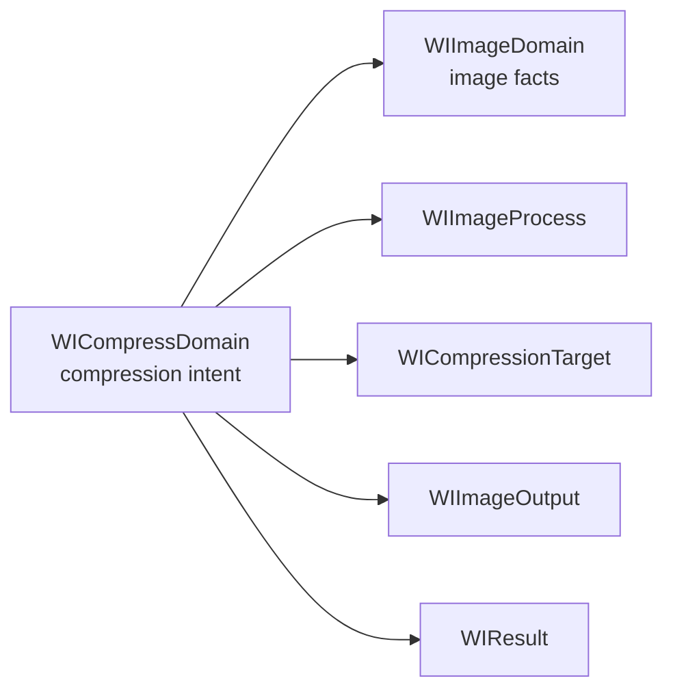

# Domain Model

[简体中文](DOMAIN_MODEL_CN.md) · [Architecture index](README.md)

This document describes the current public vocabulary shared by WICompress's
image infrastructure and compression APIs. It defines ownership and invariants;
terminal execution belongs to the request pipeline.

## Ownership

The package has two Domain targets with a one-way dependency:



`WIImageDomain` owns values that ImageIO, Rendering, and compression all need:

- integer pixel size;
- encoded image format and display orientation;
- color and color-space descriptions;
- selectable metadata categories;
- package-only geometry values used at execution boundaries.

`WICompressDomain` owns caller intent and compression failures:

- Process, Target, Output, and Result;
- resizing and crop descriptions;
- target sizing constraints;
- `WICompressError`.

Domain values do not own an encoded source, decoded pixels, a task, or an
execution lifecycle. Public access and internal reuse share the same canonical
values; the package does not maintain mirrored Core models.

## Two Compression Domains

Process and Target express opposite control directions and remain separate
public models.

| Domain | Caller controls | Library controls | Success contract |
| --- | --- | --- | --- |
| `WIImageProcess` | crop, resizing, lossy quality, and output requirements | how the declared operation is executed | performs one deterministic operation; byte count is an outcome |
| `WICompressionTarget` | hard byte ceiling, base sizing constraints, and output requirements | candidate dimensions, lossy quality, attempts, and selection | returned data is no larger than `maxBytes` |

Neither type inherits from or wraps the other. They share Output and Result
values and converge only at the internal request pipeline.

### Process

`WIImageProcess` is an immutable, `Sendable` description with four independent
parts:

```text
WIImageProcess
├── sizing
├── optional crop
├── optional lossy quality
└── output
```

Its defaults are:

| Value | Default |
| --- | --- |
| sizing | `.resize(using: WIImageResize.lubanV2)` |
| crop | `nil` |
| quality | `0.6` |
| representation | preserve the source representation |
| metadata | strip modeled metadata |
| color space | preserve display color semantics |

Process does not promise a final byte count. A fixed quality remains caller
intent and is never replaced by a library search.

### Target

`WICompressionTarget` contains exactly three groups of facts:

```text
WICompressionTarget
├── maxBytes
├── sizing
└── output
```

Its defaults are:

| Value | Default |
| --- | --- |
| sizing | `.original` |
| representation | PNG when Alpha is present, otherwise JPEG |
| metadata | strip modeled metadata |
| color space | convert to sRGB |

`maxBytes` is required and must be positive. Target sizing may supply an
optional longest-side ceiling, an optional concrete aspect ratio, or both. The
aspect-ratio crop is fixed before feedback search begins; the search may reduce
the resulting dimensions but may not change the ratio, anchor, or crop.

## Shared Output

`WIImageOutput` is shared because representation, metadata, and output color
space remain immutable requirements in both product lines:

```text
WIImageOutput
├── representation
├── metadata
└── color space
```

Lossy quality is deliberately not part of Output. Process receives a fixed
quality from the caller, while Target owns quality selection internally.

Representation owns any Alpha decision required by the destination. JPEG never
silently discards transparency: a transparent source requires an explicit,
opaque background. `pngIfAlphaOtherwiseJPEG` is a deterministic representation
choice rather than a general-purpose automatic mode.

Metadata is an `ImageMetadataOptions` set. `.strip` is the empty selection and
`.preserve` selects every currently modeled category. Callers can use ordinary
set operations to exclude categories such as GPS or maker notes. Orientation is
display geometry, not removable metadata: pixel-rendering paths bake it into
the pixels and encode orientation `.up`.

Color handling has two states: preserve source display semantics or convert to
a concrete `WIColorSpace`. Color profiles are not metadata policy.

## Geometry And Resizing

Core geometry uses integer pixels. Point size, display scale, DPI, view content
mode, and page alignment belong to UI-aware callers.

The semantic order is fixed:

```text
stored pixels + orientation
    -> oriented source pixel size
    -> optional aspect-ratio crop using a normalized anchor
    -> cropped pixel size
    -> WIImageResizing.targetSize(for:)
    -> concrete destination pixel size
```

`WIImageResizing` receives one complete source `WIPixelSize` and returns one
complete target `WIPixelSize`. It does not receive encoded data, ImageIO state,
quality, output format, target-search state, or UI units. Built-in resizing
values include Luban 1 and 2, longest-side and rectangular constraints,
proportional scaling, and an exact target size. Custom implementations use the
same contract.

Crop and resize are independent decisions. Crop selects source content;
resizing determines how many pixels that selected content receives. The public
crop describes a concrete aspect ratio and a normalized, top-left-origin
anchor. The rendering backend may fuse crop and resize into one draw without
changing this semantic order.

## Construction-Time Invariants

Values normalize only when a nearest legal meaning is unambiguous. Otherwise
construction fails with `WICompressError`.

| Value | Invariant |
| --- | --- |
| `WIPixelSize` | public construction normalizes each non-positive dimension to one pixel; ImageIO inspection remains strict |
| `WICropAnchor` | each component is clamped to `0...1`; non-finite input falls back to the center component |
| Process quality | clamped to `0...1`; invalid floating-point input falls back to `0.6` |
| `WICompressionSizing.maximumPixelSize` | when present, normalized to at least one pixel |
| `WICompressionSizing.anchor` | used only with an aspect ratio; otherwise normalized to `.center` |
| `WIAspectRatio` | width and height must be finite, positive, and form a finite positive ratio |
| `WIImageResize.scaled(by:)` | scale must be finite and positive |
| `WICompressionTarget.maxBytes` | must be greater than zero |
| resizing output | execution validates positive dimensions and rejects overflowing or non-renderable bitmap dimensions |

Built-in compression-oriented resizing does not upscale unless the selected API
states that it may do so. An exact size or caller implementation can request
upscaling explicitly.

## Result

Both terminals return `WIResult`:

| Value | Meaning |
| --- | --- |
| `data` | final encoded image bytes |
| `format` | final encoded representation family |
| `pixelSize` | final encoded pixel dimensions |
| `byteCount` | computed directly from `data.count` |

`WIResult` has no public initializer. It is an execution fact produced by a
successful terminal, not a request, mutable resource, or diagnostics container.

## Domain Boundaries

The public Domain does not model:

- UI points, Retina scale, view content mode, or page placement;
- a universal Policy object or a public processing chain;
- encoded-source or decoded-image lifecycles;
- Pipeline stages, executors, queues, or cancellation tokens;
- Target search profiles, attempt budgets, or platform-specific sharing presets;
- animated-image processing.

Those concerns either belong to infrastructure, to the closed execution
pipeline, or to the application integrating WICompress.
