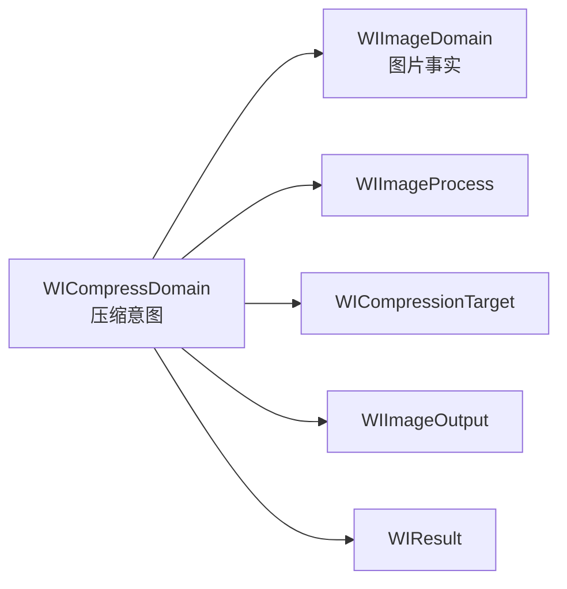

# Domain Model 架构

[English](DOMAIN_MODEL.md) · [架构索引](README_CN.md)

本文描述 WICompress 图片基础能力与压缩 API 当前共享的公共词汇，定义其所有权与不变量；
terminal 执行属于请求级 Pipeline。

## 所有权

Package 包含两个单向依赖的 Domain target：



`WIImageDomain` 拥有 ImageIO、Rendering 与压缩共同需要的值：

- 整数像素尺寸；
- 编码图片格式与显示方向；
- 颜色与颜色空间描述；
- 可选择的 metadata 类别；
- 执行边界使用的 package-only 几何值。

`WICompressDomain` 拥有调用方意图与压缩错误：

- Process、Target、Output 与 Result；
- resizing 与 crop 描述；
- Target sizing 约束；
- `WICompressError`。

Domain 值不拥有 encoded source、decoded pixels、Task 或执行生命周期。公开访问与包内复用
直接使用同一套 canonical values；Package 不维护镜像 Core models。

## 两个 Compression Domain

Process 与 Target 表达相反的控制方向，因此保持为两个独立的公共模型。

| Domain | 调用方控制 | 库控制 | 成功合同 |
| --- | --- | --- | --- |
| `WIImageProcess` | crop、resizing、有损 quality 与 output requirements | 如何执行已经声明的操作 | 执行一次确定性操作；byte count 是结果 |
| `WICompressionTarget` | 硬字节上限、基础 sizing 约束与 output requirements | 候选尺寸、有损 quality、尝试与选择 | 返回数据不超过 `maxBytes` |

两个类型互不继承，也不互相包装。它们共享 Output 与 Result，只在内部请求级 Pipeline 汇合。

### Process

`WIImageProcess` 是不可变、`Sendable` 的描述值，包含四个相互独立的部分：

```text
WIImageProcess
├── sizing
├── optional crop
├── optional lossy quality
└── output
```

默认值为：

| Value | Default |
| --- | --- |
| sizing | `.resize(using: WIImageResize.lubanV2)` |
| crop | `nil` |
| quality | `0.6` |
| representation | 保持源 representation |
| metadata | 删除已建模 metadata |
| color space | 保持显示颜色语义 |

Process 不承诺最终 byte count。固定 quality 始终是调用方意图，库不会用搜索结果替换它。

### Target

`WICompressionTarget` 只包含三组事实：

```text
WICompressionTarget
├── maxBytes
├── sizing
└── output
```

默认值为：

| Value | Default |
| --- | --- |
| sizing | `.original` |
| representation | 有 Alpha 时使用 PNG，否则使用 JPEG |
| metadata | 删除已建模 metadata |
| color space | 转换到 sRGB |

`maxBytes` 是必填的正数。Target sizing 可以提供可选最长边上限、可选具体宽高比，或同时
提供两者。宽高比裁切在反馈搜索前固定；搜索可以继续缩小结果，但不能改变比例、anchor
或 crop。

## 共享 Output

`WIImageOutput` 被两条产品线共享，因为 representation、metadata 与 output color space
在执行期间都是不可变要求：

```text
WIImageOutput
├── representation
├── metadata
└── color space
```

有损 quality 刻意不属于 Output。Process 接收调用方固定的 quality，Target 则在内部拥有
quality 选择权。

Representation 拥有 destination 所需的 Alpha 决定。JPEG 不会静默丢弃透明像素：透明
source 必须显式提供不透明背景。`pngIfAlphaOtherwiseJPEG` 是确定性的 representation
选择，而不是通用 automatic mode。

Metadata 使用 `ImageMetadataOptions` 集合。`.strip` 是空集合，`.preserve` 选择当前所有
已建模类别。调用方可以通过普通集合操作排除 GPS、maker notes 等类别。Orientation 是显示
几何，不是可删除 metadata：pixel-rendering path 会把方向烘焙进像素，并编码为 `.up`。

Color handling 只有两个状态：保持 source 显示语义，或转换到具体 `WIColorSpace`。
Color profile 不属于 metadata policy。

## Geometry 与 Resizing

Core geometry 统一使用整数像素。Point size、display scale、DPI、View content mode 与页面
alignment 属于理解 UI 上下文的调用方。

语义顺序固定为：

```text
stored pixels + orientation
    -> oriented source pixel size
    -> 使用 normalized anchor 的可选 aspect-ratio crop
    -> cropped pixel size
    -> WIImageResizing.targetSize(for:)
    -> concrete destination pixel size
```

`WIImageResizing` 接收一个完整的 source `WIPixelSize`，返回一个完整的 target
`WIPixelSize`。它不接收 encoded data、ImageIO state、quality、output format、Target
搜索状态或 UI 单位。内置 resizing 包括 Luban 1/2、最长边与矩形约束、等比缩放和 exact
target size；自定义实现遵守同一合同。

Crop 与 resize 是两个独立决定。Crop 选择 source 内容；resizing 决定被选内容最终拥有
多少像素。公共 crop 描述 concrete aspect ratio，以及使用左上原点的 normalized anchor。
Rendering backend 可以把 crop 与 resize 融合成一次绘制，但不改变这条语义顺序。

## 构造期不变量

只有最近合法含义明确时，值才会自动规范化；否则构造会抛出 `WICompressError`。

| Value | Invariant |
| --- | --- |
| `WIPixelSize` | public construction 将每个非正维度归一为一个像素；ImageIO inspection 仍严格校验 |
| `WICropAnchor` | 每个分量 clamp 到 `0...1`；非有限输入回退到对应中心分量 |
| Process quality | clamp 到 `0...1`；非法浮点输入回退到 `0.6` |
| `WICompressionSizing.maximumPixelSize` | 存在时至少归一为一个像素 |
| `WICompressionSizing.anchor` | 只在存在 aspect ratio 时使用；否则归一为 `.center` |
| `WIAspectRatio` | width/height 必须有限、为正，并形成有限正比例 |
| `WIImageResize.scaled(by:)` | scale 必须有限且为正 |
| `WICompressionTarget.maxBytes` | 必须大于零 |
| resizing output | 执行时校验正尺寸，并拒绝算术溢出或无法渲染的 bitmap dimensions |

内置压缩向 resizing 默认不放大，除非所选 API 明确声明允许。Exact size 或调用方自定义
实现可以显式请求放大。

## 结果

两条 terminal 都返回 `WIResult`：

| Value | Meaning |
| --- | --- |
| `data` | 最终编码图片字节 |
| `format` | 最终编码 representation family |
| `pixelSize` | 最终编码像素尺寸 |
| `byteCount` | 直接由 `data.count` 计算 |

`WIResult` 没有 public initializer。它是成功 terminal 产生的执行事实，不是 request、
mutable resource 或 diagnostics container。

## Domain 边界

公共 Domain 不建模：

- UI points、Retina scale、View content mode 或页面 placement；
- 通用 Policy object 或 public processing chain；
- encoded-source 或 decoded-image 生命周期；
- Pipeline stages、executors、queues 或 cancellation tokens；
- Target search profiles、attempt budgets 或平台分享 presets；
- 动图处理。

这些内容分别属于基础能力、封闭执行 Pipeline，或集成 WICompress 的应用层。
