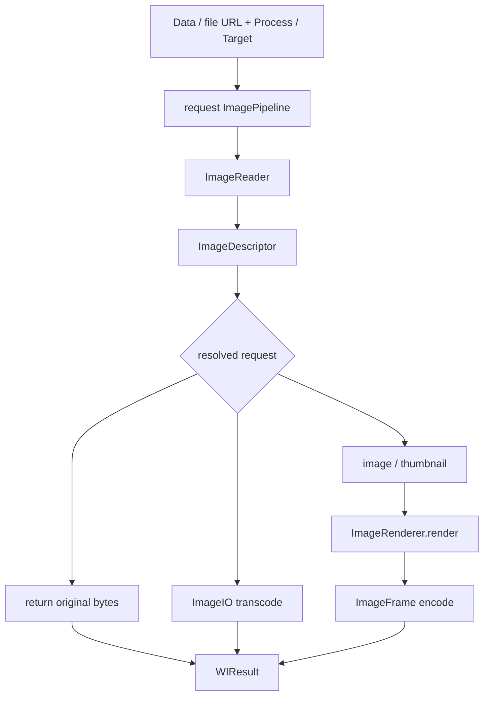

# Execution Pipeline

[简体中文](EXECUTION_PIPELINE_CN.md) · [Architecture index](README.md)

This document describes how one WICompress terminal call is owned and executed.
`ImagePipeline` is package-only orchestration; it is not a public workflow API.

## Request Ownership

Every Data or file-URL terminal creates one request-scoped `ImagePipeline`.
That Pipeline is the only owner that knows all of the following at once:

- the immutable original input;
- its ImageIO reader and inspected descriptor;
- the Process or Target request;
- resolved geometry and output requirements;
- whether original, transcode, or pixel-rendering execution is valid;
- reusable working pixels and Target feedback-search state;
- the final encoded result and its contract checks.

The public facade starts execution but does not own a second state machine.
ImageIO and Rendering provide synchronous capabilities but do not choose the
request's next operation.

## Request Flow

The Pipeline chooses the shortest path that satisfies the request instead of
forcing every input through a fixed stage chain.



Inspection, decode, Rendering, and encode are capability names, not public or
registerable Stage objects.

## Input, Reader, And Descriptor Lifetime

The original input remains immutable for the entire request:

- A Data terminal retains the encoded bytes required by the request.
- A file terminal passes its URL directly to a file-backed `ImageReader`; the
  Pipeline does not first call `Data(contentsOf:)` to create a complete in-memory
  copy. ImageIO may still read any or all file contents while operating.
- Original passthrough explicitly materializes the file as `Data` when those
  encoded bytes must be returned.

Source-independent request invariants can be checked before creating a reader.
Once source-dependent work begins, the Pipeline creates one `ImageReader`,
inspects the original source once, and holds its immutable `ImageDescriptor`.
The descriptor contains stable encoded facts such as format, byte count, pixel
size, orientation, frame count, Alpha, metadata categories, and gain-map
presence. Source color is read lazily only when an output decision needs it.

An inspection of newly encoded result data used to construct `WIResult` does
not replace or mutate the original descriptor.

`ImageReader` and decoded `ImageFrame` values are request-local. They are not
shared across actors, terminal calls, or a global cache.

## Process Execution

Process is a deterministic execution:

```text
descriptor + WIImageProcess
    -> resolve crop, destination size, quality, and output
    -> choose one execution path
    -> encode at most one final result
    -> WIResult
```

The three execution paths are:

### Original

The original bytes can be returned only when every observable Process
requirement is already satisfied. Any required crop, size change, fixed lossy
quality, representation rewrite, metadata change, Alpha flatten, orientation
normalization, or color conversion prevents this path.

### Transcode

ImageIO transcode is used when encoded representation properties must change
but pixels do not. It can rewrite supported representation, quality, and
metadata properties while preserving source display semantics, without
introducing a Rendering operation. The Pipeline verifies that the complete
transcode options are supported before selecting this path.

### Render

Pixel-changing work obtains an ImageIO image or thumbnail, then sends only
resolved facts to `ImageRenderer`. Orientation, crop, resize, background,
Alpha, and color conversion are fused into one final raster draw. The rendered
frame is then encoded by ImageIO. No intermediate encoded Data is fed into a
second pixel operation.

## Target Feedback Search

Target execution contains a feedback loop because encoded byte count is known
only after encoding a candidate:

```text
descriptor + WICompressionTarget
    -> resolve fixed crop and base size once
    -> try original passthrough when the full contract is already satisfied
    -> propose geometry and quality
    -> prepare or reuse working pixels
    -> encode candidate and observe data.count
    -> update search state
    -> select a feasible candidate
    -> final hard check
    -> WIResult
```

The crop ratio, anchor, and base sizing constraints are resolved before the
loop. Search may reduce a uniform scale and, for lossy representations, adjust
quality. It never changes immutable Output requirements or discards additional
source content.

Working pixels are reusable only within the same request and geometry:

- quality-only attempts reuse the same rendered `CGImage`;
- a geometry change derives new pixels from the immutable original source;
- encoded candidate Data never becomes the source of the next attempt;
- source-transcode and original paths do not create a working bitmap.

Lossless PNG has no lossy-quality dimension. It can satisfy a Target by original
passthrough, supported transcode, or dimension reduction when sizing permits.
Attempt budgets, quality profiles, size estimation, and candidate ranking are
internal algorithm details rather than public Target fields.

Every successful Target result passes a final, unconditional check:

```text
result.data.count <= target.maxBytes
```

The Pipeline never relaxes representation, metadata, color-space, Alpha, crop,
or hard-byte requirements to manufacture a result. If no supported candidate
satisfies the complete contract, execution fails with `WICompressError`.

## Capability Boundaries

The Pipeline orchestrates three lower-level responsibility sets:

| Owner | Responsibility | Does not decide |
| --- | --- | --- |
| `WIImageIO` | inspect, image, thumbnail, transcode, encode, metadata provenance, runtime format capability | Process/Target meaning, passthrough eligibility, crop, Target search |
| `WIImageRendering` | execute resolved orientation, crop, resize, background, Alpha, and color facts in one bitmap operation | representation, metadata, quality, byte budget, resizing intent |
| `ImagePipeline` | interpret the complete request, select the path, own working state, map errors, and construct `WIResult` | UI policy or application-specific sharing rules |

Pure calculations remain ordinary functions or small algorithm values when
they have a complete input/output contract. They do not become independent
request owners.

## Synchronous And Asynchronous Terminals

The execution core is synchronous and ordered. Public synchronous and
asynchronous overloads call the same Pipeline implementation:

```text
sync terminal  -> run the Pipeline in the current calling context
async terminal -> run the same Pipeline on a concurrent executor
```

Synchronous overloads use typed `throws(WICompressError)` and do not inspect
surrounding Task cancellation.

Asynchronous overloads use Swift 6.2 `@concurrent`. They leave the caller's
actor without creating `Task.detached`, so they remain part of the caller's
structured Task and inherit its priority, task-local values, and cancellation
context. Their signature uses ordinary `async throws`: processing failures are
`WICompressError`, while cancellation remains the standard
`CancellationError`.

Cancellation is cooperative. The Pipeline checks it around request setup,
inspection, decision boundaries, decode/thumbnail, Rendering, transcode,
encode, result validation, and each Target prepare/encode attempt. ImageIO and
Core Graphics operations are synchronous and expose no cancellation handle;
an operation already in progress may finish before the next checkpoint observes
cancellation.

ImageIO and Rendering do not create queues, actors, executors, tasks, or public
cancellation tokens of their own.

## Pipeline Invariants

- One terminal call has one state and orchestration owner.
- The original input and its descriptor never change during the request.
- The original source is inspected at most once.
- Process executes one resolved operation and does not search byte count.
- Target candidates always derive from the original source, never from a prior
  encoded candidate.
- Working pixels never escape the request or cross actor boundaries.
- Output requirements remain immutable during all execution paths and Target
  attempts.
- Target success is impossible without the final `maxBytes` check.
- Sync and async overloads share decisions, errors, image quality, and result
  semantics.

## Execution Boundaries

The package does not expose:

- `ImagePipeline`, its Reader, working image, or search state;
- public stage protocols, registries, plugins, or a mutable image container;
- public executor, queue, retry count, search profile, or cancellation token;
- a second Process or Target execution owner;
- cross-request decoded-image caching;
- animated-image, incremental-decode, or HDR execution pipelines.

Applications extend only documented Domain slots, such as
`WIImageResizing`, and provide concrete facts that the Pipeline can validate.
