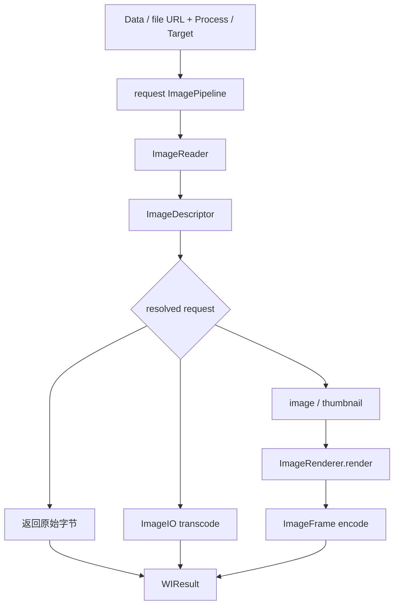

# Execution Pipeline 架构

[English](EXECUTION_PIPELINE.md) · [架构索引](README_CN.md)

本文描述一次 WICompress terminal 调用如何被拥有和执行。`ImagePipeline` 是 package-only
编排，不是公共工作流 API。

## 请求所有权

每个 Data 或 file-URL terminal 都会建立一个请求级 `ImagePipeline`。只有这个 Pipeline
同时知道以下全部事实：

- 不可变的原始输入；
- 对应的 ImageIO Reader 与 inspection descriptor；
- Process 或 Target request；
- 已解析的 geometry 与 output requirements；
- original、transcode 或 pixel-rendering 中哪条执行路径成立；
- 可复用 working pixels 与 Target feedback-search state；
- 最终 encoded result 及其合同检查。

Public facade 启动执行，但不拥有第二套状态机。ImageIO 与 Rendering 提供同步能力，但不
决定一次请求的下一步操作。

## 请求流

Pipeline 选择满足请求的最短路径，不强迫所有输入经过固定 Stage chain。



Inspection、decode、Rendering 与 encode 是能力名称，不是公共或可注册的 Stage object。

## Input、Reader 与 Descriptor 生命周期

原始输入在整个请求中保持不可变：

- Data terminal 保留请求所需的 encoded bytes。
- File terminal 把 URL 直接交给 file-backed `ImageReader`；Pipeline 不会先调用
  `Data(contentsOf:)` 在内存中建立完整副本。ImageIO 执行操作时仍可能读取任意乃至
  全部文件内容。
- Original passthrough 确实需要返回编码字节时，才显式把文件 materialize 成
  `Data`。

不依赖 source 的 request invariant 可以在创建 Reader 前检查。进入 source-dependent work
后，Pipeline 创建一个 `ImageReader`，只 inspect 原始 source 一次，并持有其不可变
`ImageDescriptor`。Descriptor 包含 format、byte count、pixel size、orientation、frame
count、Alpha、metadata categories 与 gain-map presence 等稳定 encoded facts。只有 output
decision 需要时才按需读取 source color。

为建立 `WIResult` 而检查新 encoded result，不会替换或修改原始 descriptor。

`ImageReader` 与 decoded `ImageFrame` 都只属于当前请求，不跨 actor、terminal call 或
global cache 共享。

## Process 执行

Process 是确定性执行：

```text
descriptor + WIImageProcess
    -> resolve crop, destination size, quality, and output
    -> choose one execution path
    -> encode at most one final result
    -> WIResult
```

三条执行路径分别为：

### Original

只有原始字节已经满足全部可观察 Process requirement 时才能直接返回。任何必须执行的
crop、尺寸变化、固定有损 quality、representation rewrite、metadata change、Alpha
flatten、orientation normalization 或 color conversion 都会排除这条路径。

### Transcode

当 encoded representation properties 必须变化，但 pixels 不需要变化时，使用 ImageIO
transcode。它可以在保持 source display semantics 且不引入 Rendering 的情况下，重写受
支持的 representation、quality 与 metadata properties。Pipeline 选择此路径前会验证
完整 transcode options 是否受支持。

### Render

Pixel-changing work 通过 ImageIO 取得 image 或 thumbnail，再只把已解析事实交给
`ImageRenderer`。Orientation、crop、resize、background、Alpha 与 color conversion
融合为一次最终 raster draw，然后由 ImageIO 编码 rendered frame。不会把中间 encoded
Data 再送入第二次 pixel operation。

## Target 反馈搜索

Target 执行包含 feedback loop，因为只有编码候选后才能知道 encoded byte count：

```text
descriptor + WICompressionTarget
    -> resolve fixed crop and base size once
    -> 完整合同已满足时尝试 original passthrough
    -> propose geometry and quality
    -> prepare or reuse working pixels
    -> encode candidate and observe data.count
    -> update search state
    -> select a feasible candidate
    -> final hard check
    -> WIResult
```

Crop ratio、anchor 与基础 sizing constraint 在循环前解析。搜索可以降低统一 scale，并对
有损 representation 调整 quality；它不能改变 immutable Output requirements，也不能额外
丢弃 source 内容。

Working pixels 只能在同一请求、同一 geometry 下复用：

- 仅 quality 变化的尝试复用同一张 rendered `CGImage`；
- geometry 变化时从不可变原始 source 产生新 pixels；
- encoded candidate Data 永远不会成为下一次尝试的 source；
- source-transcode 与 original path 不创建 working bitmap。

Lossless PNG 没有有损 quality 维度。它可以通过 original passthrough、受支持的 transcode，
或在 sizing 允许时缩小尺寸来满足 Target。Attempt budgets、quality profiles、size
estimation 与 candidate ranking 都是内部算法细节，不是公共 Target fields。

每个成功 Target result 都必须经过无条件最终检查：

```text
result.data.count <= target.maxBytes
```

Pipeline 不会放宽 representation、metadata、color-space、Alpha、crop 或 hard-byte
requirement 来制造结果。如果没有受支持的 candidate 满足完整合同，执行会以
`WICompressError` 失败。

## Capability 边界

Pipeline 编排三组底层职责：

| Owner | Responsibility | Does not decide |
| --- | --- | --- |
| `WIImageIO` | inspect、image、thumbnail、transcode、encode、metadata provenance 与 runtime format capability | Process/Target 语义、passthrough eligibility、crop、Target search |
| `WIImageRendering` | 在一次 bitmap operation 中执行 resolved orientation、crop、resize、background、Alpha 与 color facts | representation、metadata、quality、byte budget、resizing intent |
| `ImagePipeline` | 解释完整 request、选择路径、拥有 working state、映射错误并构造 `WIResult` | UI policy 或应用特定的分享规则 |

纯计算在拥有完整 input/output contract 时保留为普通函数或小型 algorithm value，不会成为
独立 request owner。

## 同步与异步 Terminal

执行核心保持同步、有序。Public 同步与异步 overload 调用同一个 Pipeline 实现：

```text
sync terminal  -> 在当前调用上下文运行 Pipeline
async terminal -> 在 concurrent executor 上运行同一个 Pipeline
```

同步 overload 使用 typed `throws(WICompressError)`，不会观察 surrounding Task
cancellation。

异步 overload 使用 Swift 6.2 `@concurrent`。它们离开 caller actor，但不创建
`Task.detached`，因此仍属于调用方的 structured Task，并继承 priority、task-local values
与 cancellation context。签名使用普通 `async throws`：图片处理失败是
`WICompressError`，取消则保持标准 `CancellationError`。

Cancellation 是 cooperative 的。Pipeline 会在 request setup、inspection、decision
boundary、decode/thumbnail、Rendering、transcode、encode、result validation，以及每个
Target prepare/encode attempt 前后检查取消。ImageIO 与 Core Graphics 操作是同步的，且
没有 cancellation handle；已经开始的操作可能先完成，随后才在下一个 checkpoint 观察到
取消。

ImageIO 与 Rendering 不建立自己的 queue、actor、executor、Task 或 public cancellation
token。

## Pipeline 不变量

- 一次 terminal 调用只有一个状态与编排 owner。
- 原始输入与 descriptor 在请求期间永不改变。
- 原始 source 最多 inspect 一次。
- Process 执行一个已解析操作，不搜索 byte count。
- Target candidate 始终从原始 source 派生，不从上一份 encoded candidate 派生。
- Working pixels 不逃逸当前请求，也不跨 actor boundary。
- 所有执行路径与 Target attempt 中的 Output requirements 保持不可变。
- 未通过最终 `maxBytes` 检查时，Target 不可能成功。
- 同步与异步 overload 共享 decision、error、image quality 与 result semantics。

## Execution 边界

Package 不公开：

- `ImagePipeline`、内部 Reader、working image 或 search state；
- public stage protocol、registry、plugin 或 mutable image container；
- public executor、queue、retry count、search profile 或 cancellation token；
- 第二个 Process 或 Target execution owner；
- 跨请求 decoded-image cache；
- 动图、incremental-decode 或 HDR execution pipeline。

应用只能扩展已记录的 Domain slot，例如 `WIImageResizing`，并提供 Pipeline 能够验证的
concrete facts。
