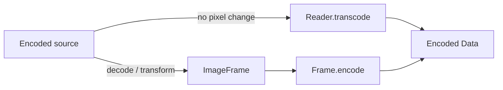

# ImageIO Architecture

[简体中文](IMAGE_IO_CN.md) · [Architecture index](README.md)

`WIImageIO` is a public, synchronous library that turns ImageIO's Core
Foundation interface into a small typed model. It can be used independently of
`WICompress`.

## Boundary

```text
encoded Data / file URL
          │
          ▼
     ImageReader ──────► ImageDescriptor
          │
          ├── image / thumbnail ──► ImageFrame ──► encode ──► Data
          │
          └── transcode ────────────────────────────────────► Data
```

The public exchange points are stable Swift values:

- `ImageReader` owns one encoded ImageIO source and its inspection result.
- `ImageDescriptor` contains source facts that are available without a full
  pixel decode.
- `ImageFrame` contains a `CGImage`, its display orientation, and private
  metadata provenance used by a later encode.
- Option values describe one decode, thumbnail, transcode, or encode operation.

Raw ImageIO sources, destinations, property dictionaries, and finalize calls
never cross the module boundary.

## Reader and inspection

Creating `ImageReader` from `Data` creates a data-backed source. Creating it
with `contentsOf:` passes the file URL directly to `CGImageSourceCreateWithURL`
instead of first materializing the file as a standalone `Data` value. ImageIO
still controls its own I/O and may read any or all of the file during
inspection, decode, or transcode. A higher layer separately materializes
`Data` if original-data passthrough must return the encoded bytes.

Inspection occurs once during Reader creation. `ImageReader.inspect` is a
short-lived convenience for callers that only need the descriptor.

`ImageDescriptor` separates stored facts from display geometry:

| Fact | Meaning |
| --- | --- |
| `type` / `format` | ImageIO container identity and the library's supported format view. |
| `byteCount` | Encoded source byte count, never a guessed zero. |
| `pixelSize` | Stored pixel width and height before display orientation. |
| `orientation` | EXIF/ImageIO display transform. |
| `orientedPixelSize` | Display width and height after orientation. |
| `frameCount` | Number of encoded frames. Pixel operations require exactly one. |
| `hasAlpha` | ImageIO's alpha fact when available; `nil` means unknown. |
| `metadata` | Modeled metadata categories present in the source. |
| `hasGainMap` | Whether ImageIO exposes an HDR gain map. |

Color space is intentionally read on demand with `colorSpace()`: resolving it
may decode the image and therefore is not a cheap descriptor fact.

## Decode and thumbnail

`image(options:)` decodes the stored pixels and preserves the descriptor's
display orientation on the returned frame. It does not silently redraw the
pixels.

`thumbnail(options:)` asks ImageIO to downsample while decoding. By default it
also applies the display transform, so the returned frame orientation becomes
`.up`. This is the preferred primitive when the final operation uses the full
source and a smaller pixel size.

Both methods reject multi-frame input before reading frame zero. Animation
requires a different, stateful session model and is not part of 2.0.

## Transcode and encode

Transcode and encode serve different data paths:



`transcode(as:options:)` lets ImageIO write from the encoded source when the
requested type, quality, maximum pixel size, and metadata selection can be
represented without exposing pixels. It is a capability, not a promise that
every option combination is lossless.

`ImageFrame.encode(as:options:)` writes caller-owned or decoded pixels. A frame
created by a Reader carries private metadata provenance; a frame constructed
from a caller's `CGImage` does not invent source metadata.

`ImageReader.canDecode` and `canEncode` report the current ImageIO runtime's
registered types. Capability belongs to the runtime and destination type, not
to `ImageDescriptor`.

## Metadata and orientation

`ImageMetadataOptions` models Exif, GPS, IPTC, TIFF, and maker notes as an
`OptionSet`. The module filters the underlying dictionaries, removes display
orientation from copied metadata, and writes the frame orientation explicitly.
Maker notes are treated independently even though ImageIO stores them inside
the Exif dictionary.

Unmodeled metadata is kept only when the caller requests complete preservation,
or complete preservation minus GPS. The second form enables the dedicated
GPS-removal transcode without silently discarding unknown metadata. Every other
selective request prevents unknown fields from passing through a source-copy
path.

## Scheduling and lifetime

All operations are synchronous. `ImageReader` and `ImageFrame` are scoped
operation values, not global registries or concurrency objects. The caller owns
its actor/executor choice. High-level `WICompressor` async terminals provide
their own scheduling and cancellation around these primitives.

An ImageIO or Core Graphics call already in progress cannot be force-cancelled.
The compression pipeline therefore checks cancellation between operations, not
inside this module.

## Ownership exclusions

`WIImageIO` does not own:

- compression defaults, crop geometry, quality search, or byte targets;
- Core Graphics canvas rendering or color conversion between rendered pixels;
- request scheduling, cancellation, request merging, caches, or global codec
  registries;
- UIKit/AppKit image conversion;
- animated frame sessions.

Those boundaries keep the public chain useful on its own without turning it
into a second compression pipeline.
