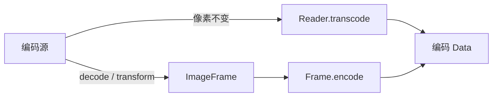

# ImageIO 架构

[English](IMAGE_IO.md) · [架构索引](README_CN.md)

`WIImageIO` 是一个可以脱离 `WICompress` 独立使用的公开同步 library。它把
ImageIO 的 Core Foundation 接口收敛为一组小而强类型的模型。

## 边界

```text
编码后的 Data / 文件 URL
          │
          ▼
     ImageReader ──────► ImageDescriptor
          │
          ├── image / thumbnail ──► ImageFrame ──► encode ──► Data
          │
          └── transcode ────────────────────────────────────► Data
```

公开交换点都是稳定的 Swift 值：

- `ImageReader` 持有一个编码源和它的一次 inspection 结果。
- `ImageDescriptor` 保存不需要完整像素 decode 就能得到的源图事实。
- `ImageFrame` 保存 `CGImage`、显示方向，以及供后续编码使用的私有 metadata
  provenance。
- Options 描述一次 decode、thumbnail、transcode 或 encode 操作。

原始 ImageIO source、destination、properties 字典和 finalize 调用不会越过模块边界。

## Reader 与 inspection

用 `Data` 创建 `ImageReader` 会得到 data-backed source；使用 `contentsOf:` 会把文件
URL 直接交给 `CGImageSourceCreateWithURL`，不会先把整个文件 materialize 成独立
`Data`。ImageIO 仍然自行决定 I/O，inspection、decode 或 transcode 期间可能读取任意乃至
全部文件内容。如果高层的 original-data passthrough 需要返回编码字节，它会另外
materialize `Data`。

Reader 创建时只 inspection 一次。只需要 descriptor 的调用方可以使用短生命周期的
`ImageReader.inspect`。

`ImageDescriptor` 明确分开存储事实与显示 geometry：

| 事实 | 含义 |
| --- | --- |
| `type` / `format` | ImageIO 容器身份，以及库支持的格式视图。 |
| `byteCount` | 编码源真实字节数，不用猜测的 `0` 代替未知。 |
| `pixelSize` | 应用显示方向前的存储宽高。 |
| `orientation` | EXIF/ImageIO 显示变换。 |
| `orientedPixelSize` | 应用方向后的显示宽高。 |
| `frameCount` | 编码帧数；像素操作只接受单帧。 |
| `hasAlpha` | ImageIO 能给出时的 alpha 事实；`nil` 表示未知。 |
| `metadata` | 源图中已建模的 metadata 类别。 |
| `hasGainMap` | ImageIO 是否暴露 HDR gain map。 |

Color space 通过 `colorSpace()` 按需读取：解析它可能发生 decode，因此它不是廉价的
descriptor 事实。

## Decode 与 thumbnail

`image(options:)` 解码存储像素，并把 descriptor 的显示方向保留在返回 Frame 上，
不会偷偷 redraw 像素。

`thumbnail(options:)` 让 ImageIO 在 decode 阶段完成降采样。默认同时应用显示方向，
所以返回 Frame 的 orientation 是 `.up`。当最终操作使用完整源图且目标尺寸更小时，
这是首选 primitive。

两个方法都会在读取 frame zero 前拒绝多帧输入。动图需要另一套有状态 Session，
不属于 2.0 边界。

## Transcode 与 encode

两者服务于不同数据路径：



当目标 type、quality、maximum pixel size 和 metadata 选择可以由 ImageIO 直接表达
时，`transcode(as:options:)` 从编码源写入，不暴露像素。它是一种能力，不承诺任意
options 组合都是无损的。

`ImageFrame.encode(as:options:)` 负责写入调用方或 Reader 解码出的像素。Reader
生成的 Frame 带有私有 metadata provenance；调用方用 `CGImage` 构造的 Frame 不会
凭空制造来源 metadata。

`ImageReader.canDecode` 与 `canEncode` 反映当前 ImageIO runtime 注册的类型。Capability
属于 runtime 与目标 type，不属于 `ImageDescriptor`。

## Metadata 与 orientation

`ImageMetadataOptions` 用 `OptionSet` 建模 Exif、GPS、IPTC、TIFF 和 maker notes。
模块会过滤底层字典、从复制的 metadata 中移除显示方向，并显式写入 Frame 的
orientation。虽然 ImageIO 把 maker notes 放在 Exif 字典里，这里仍把它作为独立类别。

只有调用方要求完整 preserve，或者“完整 preserve 但删除 GPS”时，才保留未建模
metadata。后者用于专门的 GPS-removal transcode，不会顺带丢弃未知 metadata；其他选择性
请求不会让未知字段穿过 source-copy 路径。

## 调度与生命周期

全部操作都是同步的。`ImageReader` 与 `ImageFrame` 是 scoped operation value，
不是全局 registry 或并发对象。调用方决定 actor/executor；高层 `WICompressor` 的异步
terminal 会在这些 primitive 外部提供自己的调度与取消。

已经进入 ImageIO 或 Core Graphics 的单次调用无法被强制取消，因此压缩 Pipeline 在
操作之间检查取消，而不是把取消逻辑塞进这个模块。

## 不属于这里的所有权

`WIImageIO` 不拥有：

- 压缩默认值、crop geometry、quality 搜索或字节目标；
- Core Graphics 画布绘制或渲染像素之间的色彩转换；
- 请求调度、取消、请求合并、缓存或全局 codec registry；
- UIKit/AppKit 图片转换；
- 动画帧 Session。

这些边界让公开链路可以独立使用，同时避免它长成第二套压缩 Pipeline。
