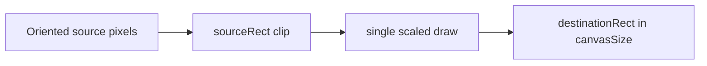

# Image Rendering Architecture

[简体中文](IMAGE_RENDERING_CN.md) · [Architecture index](README.md)

`WIImageRendering` is a package-only Core Graphics boundary. It turns one
decoded image plus fully resolved pixel facts into one orientation-baked
`CGImage`. It is an execution capability, not a policy or public processing
domain.

## Contract

```text
CGImage + ImageRenderRequest
              │
              ▼
        ImageRenderer
              │
              ▼
     orientation-baked CGImage
```

`ImageRenderRequest` is immutable and contains only facts required by one draw:

- source orientation and source crop rectangle;
- destination canvas size and destination rectangle;
- alpha surface mode;
- optional canvas and image-area backgrounds;
- source preservation or a concrete destination color space.

The source image remains a separate input. The request does not own pixels,
encoded data, format selection, quality, metadata, or byte constraints.

## Ownership

`ImageRenderer` is the single package entry. It validates the request, resolves
the destination color space, creates a `BitmapCanvas`, draws, and snapshots the
result.

`BitmapCanvas` owns the actual `CGContext` and its surface lifetime. It contains
the platform-specific mechanics that would otherwise leak across the pipeline:

- BGRA/RGBA bitmap setup and alpha storage;
- row alignment and overflow preflight;
- top-left domain coordinates to Core Graphics coordinates;
- context state save/restore, clipping, orientation transforms, and drawing;
- background fills and final image creation.

It is intentionally hidden. No other target shares a convenience abstraction
over arbitrary `CGContext` operations.

## One-pass crop and resize

Crop is represented by `sourceRect`; resize and placement are represented by
`destinationRect` inside `canvasSize`. The renderer clips to the destination and
draws the full oriented source at the scale and offset implied by those two
rectangles.



Crop and resize therefore use one sampling pass. A separately cropped
`CGImage` is not retained, avoiding both a second resample and the lifetime
surprise where `CGImage.cropping(to:)` keeps the full backing image alive.

## Coordinates and orientation

All request geometry is expressed in pixels with a top-left origin after display
orientation. `WIImageOrientation` converts between stored dimensions and
display dimensions. The canvas translates those facts into Core Graphics'
coordinate system locally and bakes orientation into the output pixels.

The returned `CGImage` is always treated as `.up` by the pipeline. Old display
orientation metadata is not copied back as a pixel transform.

## Alpha, backgrounds, and color

Alpha storage is selected before context creation:

- `.preserve` always creates a premultiplied-alpha surface, even for an opaque
  source, so uncovered canvas pixels remain transparent.
- `.opaque` creates an opaque surface for formats such as JPEG.

Backgrounds are two distinct resolved facts. A canvas background fills the
whole output surface; an image-area background fills only `destinationRect`.
Every background must be opaque. The pipeline decides when a JPEG conversion
requires one; Rendering only validates and draws the supplied color.

Color behavior is either `.source` or conversion to a concrete `WIColorSpace`.
Source mode reuses an RGB source color space when possible and otherwise falls
back to Device RGB. Conversion validates the target before allocating the
surface and uses relative-colorimetric rendering.

## Memory and failure boundary

Before creating a bitmap, the canvas checks multiplication and alignment for
minimum row bytes, 64-byte-aligned row bytes, and total surface bytes. This
prevents integer overflow from becoming an allocation or context failure.

`ImageRenderingError` reports invalid geometry, unsupported color spaces,
non-opaque backgrounds, overflow, context creation, and snapshot failures. The
compression pipeline maps those capability errors into `WICompressError` at the
product boundary.

## Scheduling and exclusions

Rendering is synchronous and contains no Task or queue logic. It does not know
about Process, Target, passthrough, transcode, retry counts, candidate ranking,
or cancellation. `ImagePipeline` checks cancellation before and after the
rendering call.

The target remains package-only until a separate public rendering use case can
define a smaller stable contract. Internal usefulness alone is not sufficient
reason to publish `BitmapCanvas` or the resolved request model.
