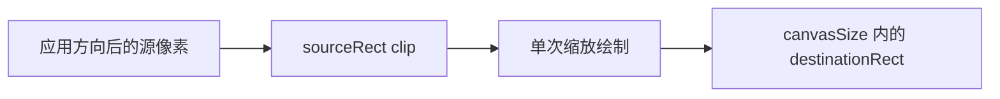

# Image Rendering 架构

[English](IMAGE_RENDERING.md) · [架构索引](README_CN.md)

`WIImageRendering` 是 package-only 的 Core Graphics 边界。它把一张已解码图片和
完全解析后的像素事实变成一张烘焙方向的 `CGImage`。它是一项执行能力，不是 Policy，
也不是公开的 Processing Domain。

## 合同

```text
CGImage + ImageRenderRequest
              │
              ▼
        ImageRenderer
              │
              ▼
       已烘焙方向的 CGImage
```

`ImageRenderRequest` 不可变，只包含一次绘制真正需要的事实：

- 源图方向与源裁切矩形；
- 目标画布尺寸与目标矩形；
- alpha surface 模式；
- 可选的 canvas background 与 image-area background；
- 保留源色彩空间，或转换到一个具体目标色彩空间。

源图片是独立输入。Request 不持有像素、编码 Data、格式选择、quality、metadata 或
字节约束。

## 所有权

`ImageRenderer` 是唯一 package 入口。它校验 Request、解析目标色彩空间、创建
`BitmapCanvas`、绘制并生成结果。

`BitmapCanvas` 持有真实 `CGContext` 和 surface 生命周期，把原本容易散落在 Pipeline
中的平台细节集中起来：

- BGRA/RGBA bitmap 配置和 alpha storage；
- row alignment 与溢出预检；
- top-left Domain 坐标到 Core Graphics 坐标的转换；
- context state 保存/恢复、clip、orientation transform 与 draw；
- background fill 和最终图片创建。

它有意保持隐藏。其他 target 不共享一套泛化任意 `CGContext` 操作的便利封装。

## 单次 crop 与 resize

Crop 由 `sourceRect` 表达；resize 与 placement 由 `canvasSize` 内的
`destinationRect` 表达。Renderer 对目标矩形 clip，再按照两个矩形隐含的比例和偏移
绘制完整的 oriented source。



因此 crop 与 resize 只发生一次采样。实现不会长期持有单独裁出的 `CGImage`，既避免
第二次重采样，也避免 `CGImage.cropping(to:)` 继续引用完整 backing image 的生命周期
问题。

## 坐标与 orientation

所有 Request geometry 都使用像素，并以应用显示方向后的 top-left 为原点。
`WIImageOrientation` 负责存储尺寸与显示尺寸之间的换算。Canvas 只在内部把这些事实
转换为 Core Graphics 坐标，并把方向烘焙进输出像素。

Pipeline 始终把返回 `CGImage` 当作 `.up`。旧显示方向 metadata 不会再次作为像素变换
写回。

## Alpha、background 与 color

Context 创建前就会决定 alpha storage：

- `.preserve` 始终使用 premultiplied-alpha surface，即使源图不透明，未覆盖的 canvas
  像素仍然透明。
- `.opaque` 为 JPEG 等格式创建不透明 surface。

Background 是两个不同的已解析事实：canvas background 填充整个输出；image-area
background 只填充 `destinationRect`。所有 background 都必须不透明。Pipeline 决定
JPEG 转换何时需要背景；Rendering 只校验并绘制传入颜色。

Color 行为是 `.source` 或转换到具体 `WIColorSpace`。Source 模式尽可能复用 RGB 源
色彩空间，否则回退到 Device RGB。转换会在分配 surface 前校验目标，并使用
relative-colorimetric rendering intent。

## 内存与错误边界

创建 bitmap 前，Canvas 会检查 minimum row bytes、64-byte-aligned row bytes 和完整
surface bytes 的乘法及对齐溢出，避免整数溢出演变成错误分配或 context failure。

`ImageRenderingError` 表达非法 geometry、不支持的色彩空间、非不透明背景、溢出、
context 创建和 snapshot 失败。压缩 Pipeline 会在 product 边界把这些 capability error
映射为 `WICompressError`。

## 调度与非职责

Rendering 完全同步，不包含 Task 或 queue。它不理解 Process、Target、passthrough、
transcode、重试次数、候选排序或取消。`ImagePipeline` 在调用 Rendering 前后检查取消。

在出现独立、稳定的公开 Rendering 用例之前，这个 target 保持 package-only。内部有用
并不足以成为发布 `BitmapCanvas` 或 resolved request model 的理由。
