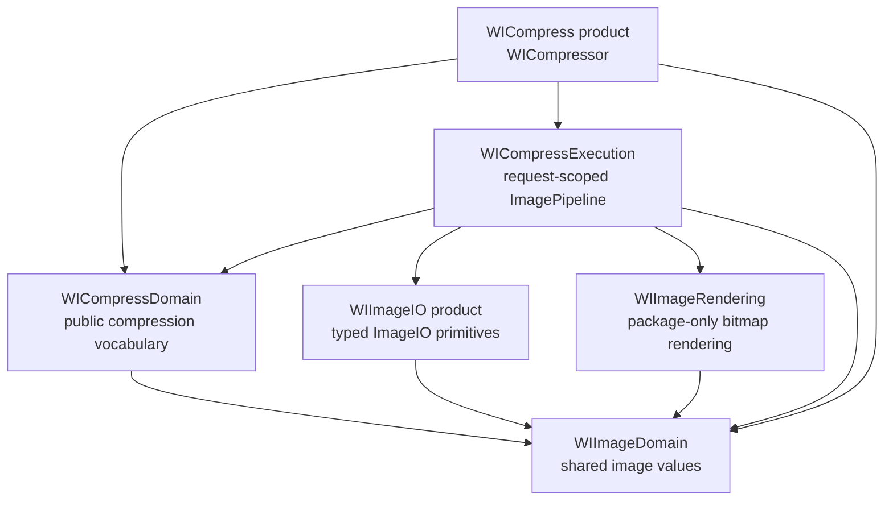
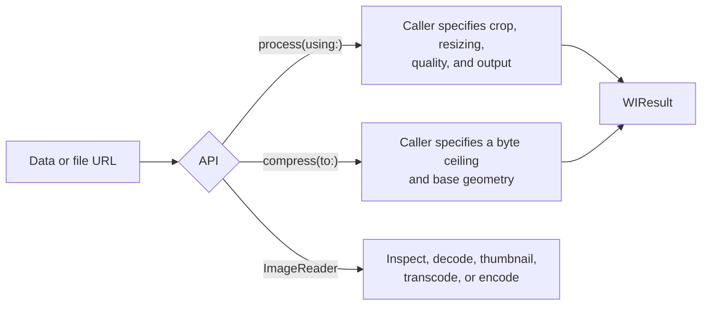

# WICompress Architecture

[简体中文](README_CN.md)

This directory describes the architecture that ships with WICompress 2.0. It is
the source of truth for module ownership, dependency direction, execution flow,
and invariants. Usage belongs in README and DocC; migration lives under
`docs/guides`, and confirmed future work belongs in `docs/ROADMAP.md`.
Refactoring retrospectives are intentionally separate from product documentation.

## Products and modules

The package publishes two libraries:

| Product | Purpose |
| --- | --- |
| `WICompress` | High-level Process and byte-target compression terminals. |
| `WIImageIO` | Lower-level synchronous inspection, decode, transcode, and encode primitives. |

The remaining targets are implementation boundaries. They prevent platform
framework details, compression intent, and request execution from becoming one
module.

Arrows mean “imports.” Dependencies point toward facts and capabilities, never
back toward orchestration.

## Three supported entry paths

`Process` and `Target` are two control models, not presets on one policy object.
They share ImageIO, Rendering, Output, and result values while retaining
different execution rules. Direct `WIImageIO` use stays synchronous and does not
enter the compression pipeline.

## Architecture documents

| Document | Question it answers |
| --- | --- |
| [Domain Model](DOMAIN_MODEL.md) | Which public values belong to Image and Compress domains? |
| [ImageIO](IMAGE_IO.md) | How do encoded sources become descriptors, frames, and encoded data? |
| [Image Rendering](IMAGE_RENDERING.md) | How are resolved crop, resize, orientation, alpha, and color facts drawn? |
| [Execution Pipeline](EXECUTION_PIPELINE.md) | How does one request choose passthrough, transcode, render, or Target search? |

## Architectural invariants

- The core accepts encoded `Data` or file `URL`; it does not depend on
  `UIImage`, `NSImage`, UIKit, or AppKit.
- `ImagePipeline` is the only compression execution owner. No public stage,
  resolver, plan, executor, solver, registry, or singleton mirrors its state.
- Domain values contain vocabulary and construction-time invariants, not
  ImageIO handles or execution lifecycle.
- `WIImageIO` hides `CGImageSource`, `CGImageDestination`, Core Foundation
  dictionaries, and finalize mechanics behind typed synchronous operations.
- `WIImageRendering` receives concrete pixel facts. It does not understand
  Process, Target, output policy, retries, or byte budgets.
- Async terminals run the same synchronous pipeline without occupying the
  caller's actor. Cancellation remains cooperative at explicit stage and search
  boundaries.
- Static pixel processing is the 2.0 product boundary. Animated sources can be
  inspected, while compression and pixel-producing operations reject them
  instead of silently collapsing to frame zero.

## Reading order

Start with [Domain Model](DOMAIN_MODEL.md), then read
[Execution Pipeline](EXECUTION_PIPELINE.md). Read [ImageIO](IMAGE_IO.md) or
[Image Rendering](IMAGE_RENDERING.md) when working on those lower-level
capabilities.
