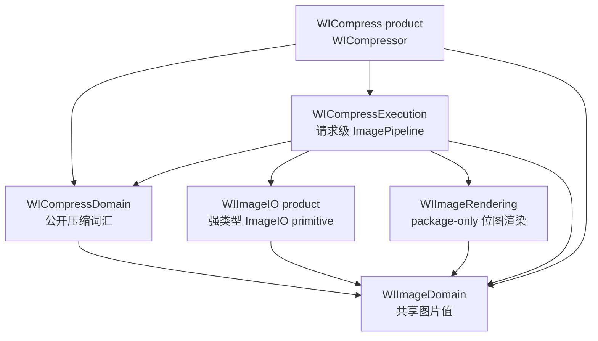
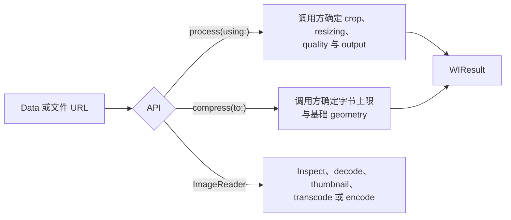

# WICompress 架构

[English](README.md)

这里记录 WICompress 2.0 当前实际交付的架构，是模块所有权、依赖方向、执行流和
不变量的唯一事实来源。README 与 DocC 负责说明如何使用；迁移指南放在
`docs/guides`，已确认的后续事项放在 `docs/ROADMAP.md`。重构过程与感悟会单独成文，
不混入产品架构文档。

## Product 与模块

Package 对外发布两个 library：

| Product | 职责 |
| --- | --- |
| `WICompress` | 高层 Process 与目标字节压缩 terminal。 |
| `WIImageIO` | 底层同步 inspection、decode、transcode 与 encode primitive。 |

其余 target 是实现边界，用来避免平台能力、压缩意图和请求执行再次混成一个模块。

箭头表示 import。依赖始终指向事实与基础能力，不会反向依赖编排层。

## 三条支持的入口

`Process` 与 `Target` 是两种控制模型，不是同一个 Policy 上的两个 preset。它们共用
ImageIO、Rendering、Output 和结果值，但保留不同的执行规则。直接调用
`WIImageIO` 时只使用同步 primitive，不会进入压缩 Pipeline。

## 架构文档

| 文档 | 回答的问题 |
| --- | --- |
| [Domain Model](DOMAIN_MODEL_CN.md) | 哪些公开值分别属于 Image 与 Compress Domain？ |
| [ImageIO](IMAGE_IO_CN.md) | 编码源如何变成 Descriptor、Frame 和新的编码数据？ |
| [Image Rendering](IMAGE_RENDERING_CN.md) | 已解析的 crop、resize、orientation、alpha 与 color 如何绘制？ |
| [Execution Pipeline](EXECUTION_PIPELINE_CN.md) | 单次请求如何选择原图、转码、渲染或 Target 搜索？ |

## 架构不变量

- Core 接收编码后的 `Data` 或文件 `URL`，不依赖 `UIImage`、`NSImage`、UIKit 或
  AppKit。
- `ImagePipeline` 是压缩执行的唯一 owner。不存在复制其状态的公开 Stage、
  Resolver、Plan、Executor、Solver、Registry 或单例。
- Domain 值只拥有词汇和构造期不变量，不持有 ImageIO handle 或执行生命周期。
- `WIImageIO` 用强类型同步操作隐藏 `CGImageSource`、`CGImageDestination`、Core
  Foundation 字典和 finalize 细节。
- `WIImageRendering` 只接收具体像素事实，不理解 Process、Target、Output Policy、
  重试或字节预算。
- 异步 terminal 使用同一套同步 Pipeline，并且不占用 caller actor；取消只在明确的
  Stage 与搜索边界协作发生。
- 静态像素处理是 2.0 的产品边界。动图源可以被 inspection；压缩与产生像素的操作会
  明确拒绝它，不会静默退化成第一帧。

## 阅读顺序

先读 [Domain Model](DOMAIN_MODEL_CN.md)，再读
[Execution Pipeline](EXECUTION_PIPELINE_CN.md)。修改底层能力时，再分别进入
[ImageIO](IMAGE_IO_CN.md) 或 [Image Rendering](IMAGE_RENDERING_CN.md)。
